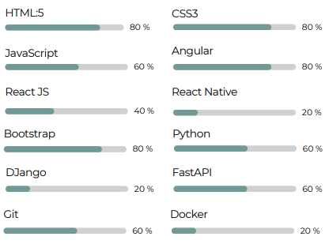

# Andres Orozco 👋

## :welcome: About me

This's Andres Orozco, I am System engineer from Medellin, Col , currently living in Miami, USA . I am a person who loves code, since 2020 I stand out mainly in Frontend development with two years of experience in languages such as HTML5, CSS3 and JavaScript, a great fan of frameworks and libraries such as Angular, React and Bootstrap. In 2023 I began to discover a new lifestyle and fell in love with Python 3 and its FastAPI framework, which motivates me to always be learning, I love order and good practices, a faithful believer in teamwork.

## :hammer_and_wrench: Languages and skills

  &nbsp;
  &nbsp;
  &nbsp;
  &nbsp;
  &nbsp;
  &nbsp;
  &nbsp;
  &nbsp;
  &nbsp;
  &nbsp;
  &nbsp;
  &nbsp;
  &nbsp;

## :fire: The most languages and skills

## :writing_hand: Where to find me

  
  
  

