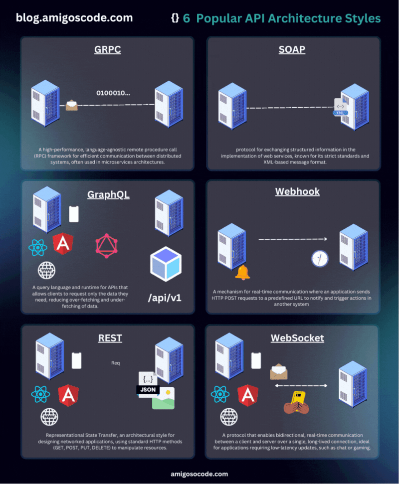

# :rocket: Recursos para Desarrolladores

Este repositorio recopila herramientas, recursos y enlaces útiles para desarrolladores de software. Aquí encontrarás desde generadores de README hasta juegos educativos, pasando por extensiones útiles y ejemplos de código.

## Indice

- :rocket: [Copilot](#copilot)
- :detective: [Aplicaciones](#apps)
- :loudspeaker: [Ingles](#english)
- :flying_saucer: [API's](#apis)
- :page_facing_up: [README Generador](#readme)
- :art: [Diseño](#design)
- :clipboard: [Curriculo Generador](#curriculum)
- :man_student: [Aprendizaje](#learning)
- :video_game: [Juegos](#games)
- :toolbox: [Extensiones](#chrome)
- :keyboard: [Extensiones VSCode](#vscode)
- :computer: [Repositorios Github](#github)
- :movie_camera: [Canales Youtube](#youtube)
- :hammer: [Herramientas](#tools)
- :closed_book: [Libros](#books)

### Copilot 

Herramientas que mejoran la productividad de desarrollo con IA.

- :rocket: [Chat GPT](https://chatgpt.com/)
- :rocket: [Claude](https://claude.ai/new)
- :rocket: [Black box](https://www.blackbox.ai/)
- :rocket: [You](https://you.com/)

### Aplicaciones 

Aplicaciones que mejoran tu desarrollo.

- :detective: [VSCode](https://code.visualstudio.com/)
- :detective: [Postman](https://www.postman.com/)
- :detective: [UrbanVPN](https://www.urban-vpn.com/)
- :detective: [Git](https://git-scm.com/downloads)
- :detective: [NVM](https://github.com/nvm-sh/nvm)

### Ingles 

Apliaciones o certificados sobre el idioma Ingles.

- :loudspeaker: [Certificación A2](https://www.freecodecamp.org/espanol/learn/a2-english-for-developers/)
- :loudspeaker: [Certificación B1](https://www.freecodecamp.org/espanol/learn/b1-english-for-developers/)
- :loudspeaker: [Vocabulario](https://www.languageguide.org/)
- :loudspeaker: [Conversaciones](https://tandem.net/es)

### API's 

Herramientas que mejoran la productividad de desarrollo con IA.

- :flying_saucer: [Rapid API](https://rapidapi.com/hub)
- :flying_saucer: [Public API](https://publicapis.dev/)
- :flying_saucer: [Dummy JSON](https://dummyjson.com/)

### README Generador 

Generadores para crear tu README de manera rápida y profesional.

- :page_facing_up: [GPRM](https://gprm.itsvg.in/) - Mejor generador de perfil en Github
- :page_facing_up: [Readme so](https://readme.so/es) - La forma más fácil de crear un README
- :page_facing_up: [Iconos](https://github.com/ikatyang/emoji-cheat-sheet) - Hoja de trucos para iconos
- :page_facing_up: [Badges](https://github.com/inttter/md-badges) - Hoja de trucos para insignias
- :page_facing_up: [Docs](https://docs.github.com/es/get-started/writing-on-github/getting-started-with-writing-and-formatting-on-github/basic-writing-and-formatting-syntax) - Documentacion oficial de README

### Diseño 

Recursos visuales y herramientas para diseñadores.

- :art: [v0 By Vercel](https://v0.dev/) - Generador de diseños
- :art: [Toools.design](https://www.toools.design/) - Ayudas para recursos
- :art: [Tailwind CSS Color Generator](https://uicolors.app/create) - Generador de colores
- :art: [Coolors](https://coolors.co/) - El generador de paletas de colores superrápido
- :art: [font Awesome](https://fontawesome.com/) - Libreria de iconos
- :art: [Lucide Icons](https://lucide.dev/icons/) - Libreria de iconos
- :art: [Google Fonts](https://fonts.google.com/) - Fuentes de Google

### Curriculo 

Herramientas para generar tu currículum profesional.

- :clipboard: [ResumeGo](https://www.resumego.net/resume-checker/) - Verificador de resumen
- :clipboard: [AI Apply](https://aiapply.co/) - Creacion de resumen

### Aprendizaje 

- :man_student: [Certiprof](https://free.certiprof.com/)
- :man_student: [Codedex](https://www.codedex.io/)
- :man_student: [Github](https://examregistration.github.com/)
- :man_student: [Freecodecamp](https://www.freecodecamp.org/espanol/learn/)

### Games 

Aprende y mejora tus habilidades de desarrollo jugando.

- :video_game: [Checkio](https://checkio.org/) - Juego para aprender Python y Typescript
- :video_game: [Codedex](https://www.codedex.io/) - Juego para aprender HTML, Python y Typescript
- :video_game: [ZType](https://www.typing.com/es/student/game/ztype) - Juego de teclao
- :video_game: [ZType](https://learngitbranching.js.org/?locale=es_ES) - Juego para aprender Git
- :apple: [Flexbox Froggy](https://flexboxfroggy.com/#es) - Juego para aprender CSS Flexbox
- :apple: [CSS Dinner](https://flukeout.github.io/) - Juego para aprender los selectores con CSS
- :apple: [Grid Garden](https://cssgridgarden.com/#es) - Juego para aprender CSS Grid
- :apple: [CSS Grid Generator io](https://cssgridgenerator.io/) - Generador de CSS Grid

### Extensiones 

Extensiones útiles para el navegador Chrome.

- :toolbox: [Wappalzer]()
- :toolbox: [SEO Meta in 1 Click]()
- :toolbox: [Visbug]()
- :toolbox: [Simulador Movil]()
- :toolbox: [ColorZilla]()
- :toolbox: [html.to.design]()
- :toolbox: [Lighthouse]()

### Extensiones VSCode 

Extensiones esenciales para Visual Studio Code.

- :keyboard: [Live Server](https://marketplace.visualstudio.com/items?itemName=ritwickdey.LiveServer)
- :keyboard: [Live Preview](https://marketplace.visualstudio.com/items?itemName=ms-vscode.live-server)
- :keyboard: [Prettier](https://marketplace.visualstudio.com/items?itemName=esbenp.prettier-vscode)
- :keyboard: [Live Share](https://code.visualstudio.com/learn/collaboration/live-share)
- :keyboard: [Git Lens](https://marketplace.visualstudio.com/items?itemName=eamodio.gitlens)
- :keyboard: [Bracket Pair Colorization](https://code.visualstudio.com/blogs/2021/09/29/bracket-pair-colorization)
- :keyboard: [Git Graph](https://marketplace.visualstudio.com/items?itemName=mhutchie.git-graph)
- :keyboard: [Intellisense for CSS Class Names in HTML](https://marketplace.visualstudio.com/items?itemName=Zignd.html-css-class-completion)
- :keyboard: [RapidAPI Client](https://marketplace.visualstudio.com/items?itemName=RapidAPI.vscode-rapidapi-client)
- :keyboard: [CodeViz](https://marketplace.visualstudio.com/items?itemName=CodeViz.codeviz)

### Github repositorios 

Repositorios útiles para desarrolladores de todos los niveles.

- :computer: [miduDev](https://github.com/midudev)
- :computer: [Frontend Joe](https://github.com/frontend-joe)
- :computer: [Bezkoder](https://github.com/bezkoder)
- :computer: [mtdvio (every-programmer-should-know)](https://github.com/mtdvio/every-programmer-should-know)

### Youtube canales 

Canales de YouTube con contenido educativo y tutoriales.

- :movie_camera: [OpenBootcamp](https://www.youtube.com/@OpenBootcamp/playlists)

### Herramientas 

Herramientas adicionales para mejorar tu flujo de trabajo.

- :hammer: [Free for dev](https://free-for.dev/#/) - Recursos para desarrolladores
- :hammer: [Ray.so](https://www.ray.so/) - Crea imagenes bonitas de tu codigo
- :hammer: [Regex101](https://regex101.com/) - Expresiones regulares
- :hammer: [JSON Generator](https://www.jsongenerator.io/) - Genara JSON a la medida
- :hammer: [JSON Data AI](https://www.jsondataai.com/) - Genara JSON a la medida
- :hammer: [Retool](https://retool.com/api-generator) - Genara JSON a la medida
- :hammer: [Squoosh](https://squoosh.app/) - Comprimidor de imagenes
- :hammer: [CSS Code Quality](https://www.projectwallace.com/css-code-quality) - Calidad del codigo CSS
- :hammer: [PageSpeed Insights](https://pagespeed.web.dev/) - Informacion de la velocidad de la pagina
- :hammer: [Pingdom](https://tools.pingdom.com/) - Informacion de la velocidad de la pagina
- :hammer: [ChartDB](https://app.chartdb.io/) - Creacion de diagrmas de bases de datos.
- :hammer: [DB Diagram](https://dbdiagram.io/home/) - Creacion de diagrmas de bases de datos.
- :hammer: [Real Favicon Generator .Net](https://realfavicongenerator.net/) - Creacion de iconos y favicon.
- :hammer: [Errores](https://erroresapp.vercel.app/) - Documentacion de errores.
- :hammer: [Commandos](https://commandsapp.vercel.app/) - Documentacion de comandos.
- :hammer: [Keyboard Gif](https://keyboardapp-brown.vercel.app/) - Creacion Gif con el teclado.
- :hammer: [Google Earth Studio](https://www.google.com/earth/studio/) - Creacion de videos sobre lugares.
- :hammer: [Mult.dev](https://mult.dev/es) - Creacion de videos sobre viajes.
- :hammer: [Git Ignore](https://www.toptal.com/developers/gitignore) - Genera .gitignore.
- :hammer: [Interview Sidekick](https://interviewsidekick.com/) - Ayudante en entrevistas.
- :hammer: [Shadow Map](https://shadowmap.org/es/) - Vistas de sol y sombras.
- :hammer: [Shots](https://shots.so/) - Creacion de mockups.

### Libros 

- :closed_book: [Libros de programación gratis](https://github.com/midudev/libros-programacion-gratis)

## Util

Algunos recursos útiles adicionales.

### Comandos Git

> Aquí te dejamos algunos comandos mas utilizados.

### Espacios de trabajo de Git

> Aquí te dejamos una explicacion de como funciona Git

### Prefijos para hacer commits en Git

> Aquí te dejamos un ejemplo con los prefijos de Git.

### Arquitecturas de una aplicacion.

> Cómo se organiza la aplicación a nivel de diseño y estructura.

### Arquitecturas de comunicación entre servicios.

> Protocolos o métodos que se usan para que los componentes de la aplicación (o aplicaciones externas) se comuniquen entre sí.

### JOIN en SQL

> Como funcionan los JOIN en SQL.

### Codigos de respuestas

> Codigos de respuestas en servicios HTTP.

