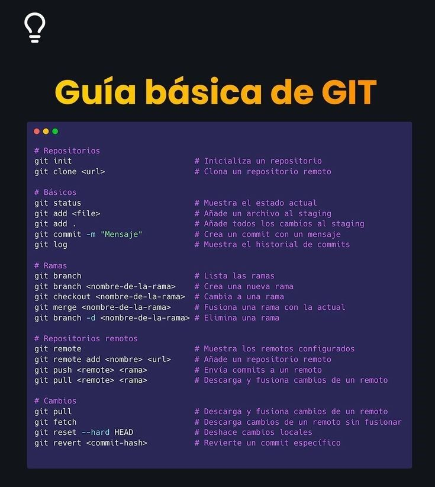
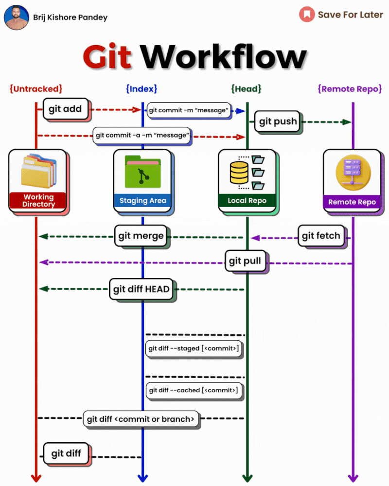
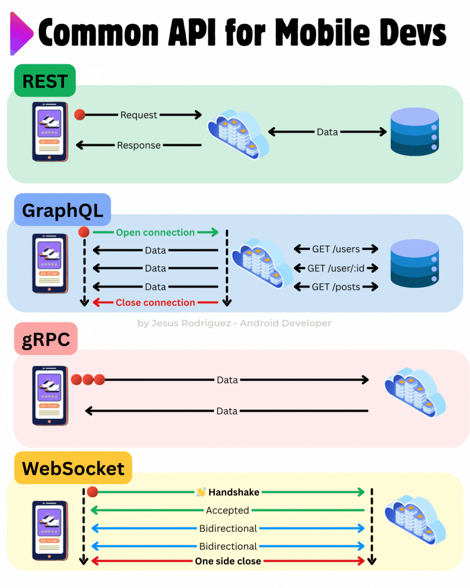
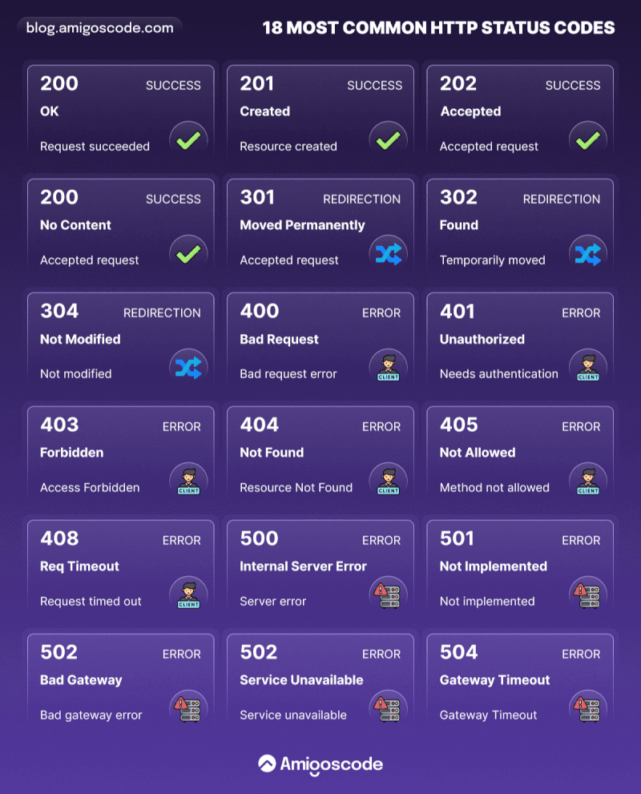
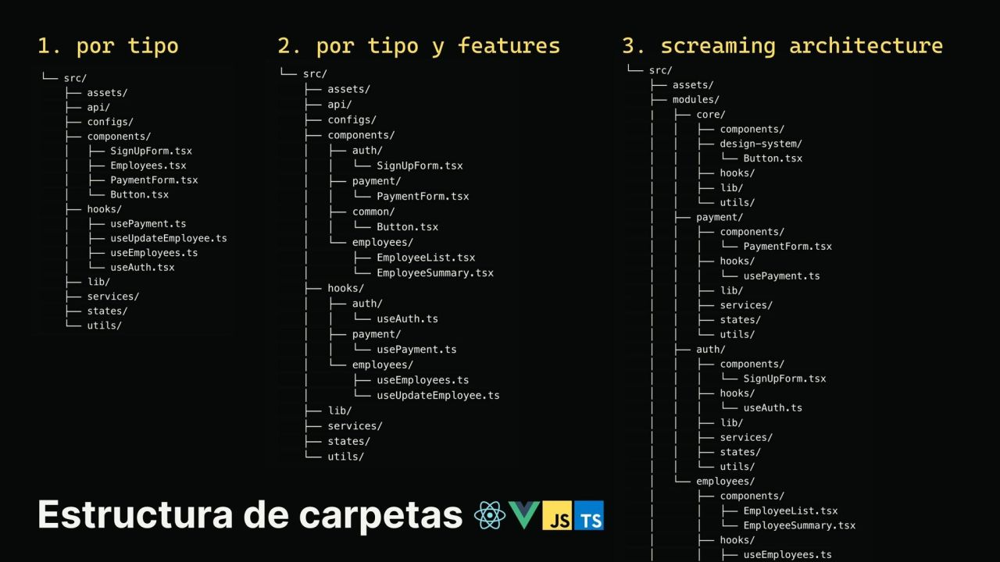
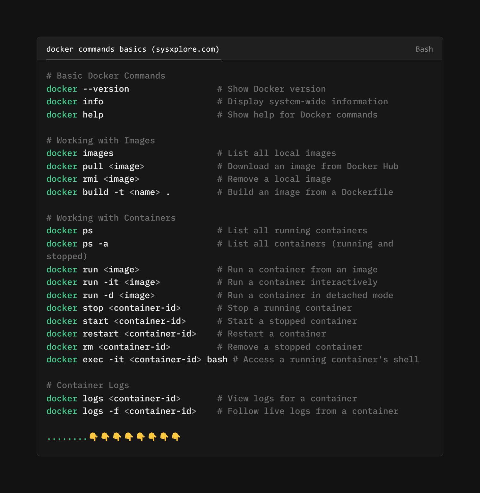
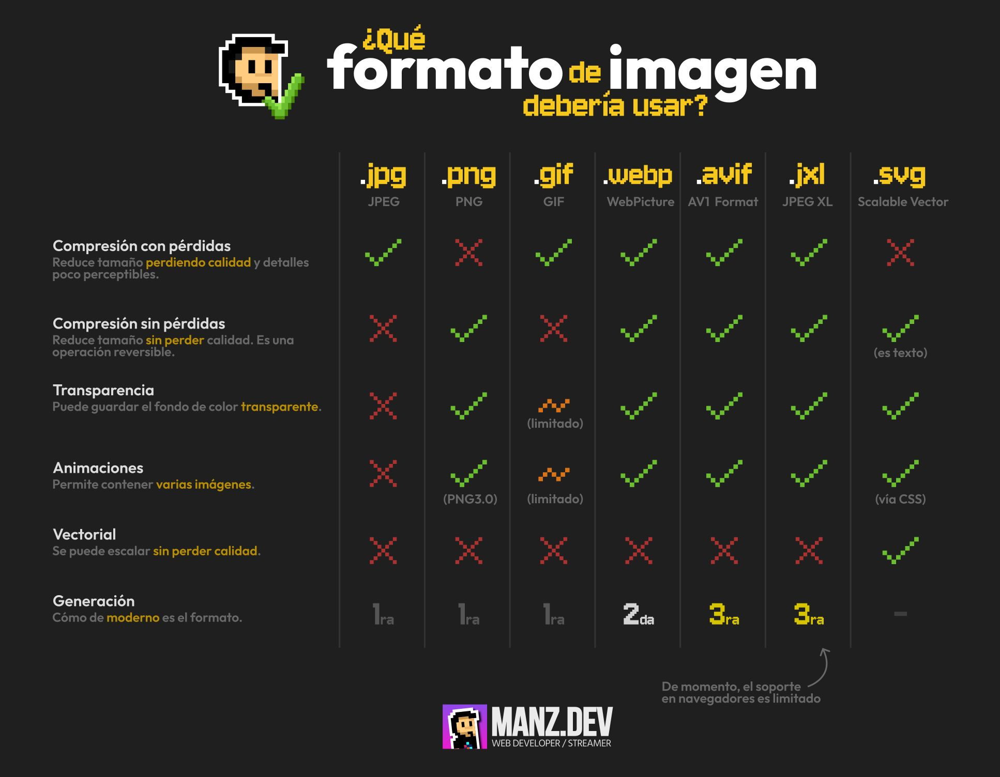

# :rocket: Recursos para Desarrolladores

Este repositorio recopila herramientas, recursos y enlaces útiles para desarrolladores de software. Aquí encontrarás desde generadores de README hasta juegos educativos, pasando por extensiones útiles y ejemplos de código.

## Indice

- :rocket: [Asistentes](#copilot)
- :detective: [Aplicaciones](#apps)
- :loudspeaker: [Ingles](#english)
- :flying_saucer: [API's](#apis)
- :page_facing_up: [README](#readme)
- :art: [Diseño](#design)
- :bellhop_bell: [Recursos](#resources)
- :classical_building: [Hosting](#hosting)
- :package: [Librerias](#packages)
- :clipboard: [Curriculo](#curriculum)
- :man_student: [Aprendizaje](#learning)
- :video_game: [Juegos](#games)
- :toolbox: [Extensiones](#chrome)
- :keyboard: [Extensiones VSCode](#vscode)
- :computer: [Repositorios Github](#github)
- :movie_camera: [Canales Youtube](#youtube)
- :hammer: [Herramientas](#tools)
- :closed_book: [Libros](#books)

### Asistentes 

Herramientas que mejoran la productividad de desarrollo con IA.

- :rocket: [Chat GPT](https://chatgpt.com/)
- :rocket: [Gemini](https://gemini.google.com/)
- :rocket: [Claude](https://claude.ai/new)
- :rocket: [Black box](https://www.blackbox.ai/)
- :rocket: [You](https://you.com/)
- :rocket: [Grok](https://grok.com/)

### Aplicaciones 

Aplicaciones que mejoran tu desarrollo.

- :detective: [VSCode](https://code.visualstudio.com/)
- :detective: [Postman](https://www.postman.com/)
- :detective: [UrbanVPN](https://www.urban-vpn.com/)
- :detective: [Git](https://git-scm.com/downloads)
- :detective: [NVM](https://github.com/nvm-sh/nvm)
- :detective: [UV](https://github.com/astral-sh/uv)
- :detective: [Ngrok](https://ngrok.com/)

### Ingles 

Apliaciones o certificados sobre el idioma Ingles.

- :loudspeaker: [Certificación EF SET](https://www.efset.org/)
- :loudspeaker: [Certificación A2](https://www.freecodecamp.org/espanol/learn/a2-english-for-developers/)
- :loudspeaker: [Certificación B1](https://www.freecodecamp.org/espanol/learn/b1-english-for-developers/)
- :loudspeaker: [Vocabulario](https://www.languageguide.org/)
- :loudspeaker: [Conversaciones](https://tandem.net/es)
- :loudspeaker: [Curso ingles](https://curso-ingles.com/)
- :loudspeaker: [BBC Learning English](https://www.bbc.co.uk/learningenglish)
- :loudspeaker: [English Practice Test](https://englishpracticetest.net/)
- :loudspeaker: [English Listening Lesson Library Online](https://elllo.org/)

### API's 

Herramientas que mejoran la productividad de desarrollo con IA.

- :flying_saucer: [Rapid API](https://rapidapi.com/hub)
- :flying_saucer: [Public API](https://publicapis.dev/)
- :flying_saucer: [Dummy JSON](https://dummyjson.com/)

### README 

Generadores para crear tu README de manera rápida y profesional.

- :page_facing_up: [GPRM](https://gprm.itsvg.in/) - Mejor generador de perfil en Github.
- :page_facing_up: [GH Profile Readme](https://rahuldkjain.github.io/gh-profile-readme-generator/) - Mejor generador de perfil en Github.
- :page_facing_up: [Readme so](https://readme.so/es) - La forma más fácil de crear un README
- :page_facing_up: [Iconos](https://github.com/ikatyang/emoji-cheat-sheet) - Hoja de trucos para iconos
- :page_facing_up: [Badges](https://github.com/inttter/md-badges) - Hoja de trucos para insignias
- :page_facing_up: [Docs](https://docs.github.com/es/get-started/writing-on-github/getting-started-with-writing-and-formatting-on-github/basic-writing-and-formatting-syntax) - Documentacion oficial de README

### Diseño 

Recursos visuales y herramientas para diseñadores.

- :art: [v0 By Vercel](https://v0.dev/) - Generador de diseños
- :art: [Toools.design](https://www.toools.design/) - Ayudas para recursos
- :art: [Tailwind CSS Color Generator](https://uicolors.app/create) - Generador de colores
- :art: [Coolors](https://coolors.co/) - El generador de paletas de colores superrápido

### Recursos  

- :bellhop_bell: [font Awesome](https://fontawesome.com/) - Libreria de iconos
- :bellhop_bell: [Lucide Icons](https://lucide.dev/icons/) - Libreria de iconos
- :bellhop_bell: [Google Fonts](https://fonts.google.com/) - Fuentes de Google
- :bellhop_bell: [Croll Bar](https://scrollbar.app/) - Estilos para el scroll.
- :bellhop_bell: [Shots](https://shots.so/) - Creacion de mockups.
- :bellhop_bell: [Python Tutor](https://pythontutor.com/) - Ejecutador de codigo python y javascript.
- :bellhop_bell: [Postspark](https://postspark.app/home) - Creacion de mockups.
- :bellhop_bell: [Lenguajecss](https://lenguajecss.com/css/funciones-css/referencia/) - Documentacion de funciones CSS.
- :bellhop_bell: [Git Ignore](https://www.toptal.com/developers/gitignore) - Genera .gitignore.
- :bellhop_bell: [Free for dev](https://free-for.dev/#/) - Recursos para desarrolladores.
- :bellhop_bell: [Ray.so](https://www.ray.so/) - Crea imagenes bonitas de tu codigo.
- :bellhop_bell: [Regex101](https://regex101.com/) - Expresiones regulares.
- :bellhop_bell: [JSON Generator](https://www.jsongenerator.io/) - Genara JSON a la medida.
- :bellhop_bell: [JSON Data AI](https://www.jsondataai.com/) - Genara JSON a la medida.
- :bellhop_bell: [Retool](https://retool.com/api-generator) - Genara JSON a la medida.
- :bellhop_bell: [Mockaroo](https://mockaroo.com/) - Genara JSON a la medida.
- :bellhop_bell: [JSON Crack](https://jsoncrack.com/editor) - Visualizador de archivos JSON.
- :bellhop_bell: [Squoosh](https://squoosh.app/) - Comprimidor de imagenes.
- :bellhop_bell: [CSS Code Quality](https://www.projectwallace.com/css-code-quality) - Calidad del codigo CSS.
- :bellhop_bell: [PageSpeed Insights](https://pagespeed.web.dev/) - Informacion de velocidad sobre la pagina.
- :bellhop_bell: [Pingdom](https://tools.pingdom.com/) - Informacion de velocidad sobre la pagina.
- :bellhop_bell: [Web Check](https://web-check.xyz/) - Informacion de velocidad sobre la pagina.
- :bellhop_bell: [SEO Test](https://seotest.me/) - Informacion de velocidad sobre la pagina.
- :bellhop_bell: [ChartDB](https://app.chartdb.io/) - Creacion de diagrmas de bases de datos.
- :bellhop_bell: [DB Diagram](https://dbdiagram.io/home/) - Creacion de diagrmas de bases de datos.
- :bellhop_bell: [DrawDB](https://www.drawdb.app/) - Creacion de diagrmas de bases de datos.
- :bellhop_bell: [Real Favicon Generator .Net](https://realfavicongenerator.net/) - Creacion de iconos y favicon.
- :bellhop_bell: [Errores](https://erroresapp.vercel.app/) - Documentacion de errores.
- :bellhop_bell: [Commandos](https://commandsapp.vercel.app/) - Documentacion de comandos.
- :bellhop_bell: [CSS Grid Generator io](https://cssgridgenerator.io/) - Generador de CSS Grid.
- :bellhop_bell: [SQLite Viewer](https://sqliteviewer.app/) - Visualizador de SQLite.
- :bellhop_bell: [Good Firts Issue](https://goodfirstissue.dev/) - Errones de codigo.
- :bellhop_bell: [W3 School - HTML Chartes](https://www.w3schools.com/charsets/default.asp) - Codigos de caracteres para HTML.

### Hosting  

- :classical_building: [Vercel]() - Aplicaciones Frontend.
- :classical_building: [Netlify]() - Aplicaciones Frontend.
- :classical_building: [Render]() - Aplicaciones Backend Express y FastAPI.
- :classical_building: [FastAPI Cloud](https://fastapicloud.com/) - Aplicaciones Backend FastAPI.
- :classical_building: [Superbase](https://supabase.com/) - Bases de datos.
- :classical_building: [Firebase]() - Bases de datos.
- :classical_building: [Dokploy](https://dokploy.com/) - Bases de datos.
- :classical_building: [Instagres](http://instagres.com/new) - Bases de datos.
  
### Librerias  

- :package: [npkill](https://www.npmjs.com/package/npkill) - Libreria para eliminar paquetes npm sin uso.

### Curriculo 

Herramientas para generar tu currículum profesional.

- :clipboard: [ResumeGo](https://www.resumego.net/resume-checker/) - Verificador de resumen.
- :clipboard: [Resume](https://resmume.com/resume-ats-checker/) - Verificador de resumen.
- :clipboard: [AI Apply](https://aiapply.co/) - Creacion de resumen.
- :clipboard: [Jobscan](https://www.jobscan.co/) - Verificador de resumen.
- :clipboard: [Resume Worded](https://resumeworded.com/index.php) - Verificador de resumen.

### Aprendizaje 

- :man_student: [Certiprof](https://free.certiprof.com/)
- :man_student: [Codedex](https://www.codedex.io/)
- :man_student: [Github](https://examregistration.github.com/)
- :man_student: [Freecodecamp](https://www.freecodecamp.org/espanol/learn/)
- :man_student: [Cursos desafio latam](https://cursos.desafiolatam.com/collections)
- :man_student: [Dev challenges](https://devchallenges.io/)
- :man_student: [Cognitives Class](https://cognitiveclass.ai/)
- :man_student: [VSCode Education](https://vscodeedu.com/courses)
- :man_student: [Leetcode](https://leetcode.com/)
- :man_student: [Front End Interview Handbook](https://www.frontendinterviewhandbook.com/)

### Games 

Aprende y mejora tus habilidades de desarrollo jugando.

- :video_game: [Checkio](https://checkio.org/) - Juego para aprender Python y Typescript.
- :video_game: [Codedex](https://www.codedex.io/) - Juego para aprender HTML, Python y Typescript.
- :video_game: [CodeStrike](https://store.steampowered.com/app/3444170/CodeStrike__Python_Practice_Adventure_Game/) - Juego para aprender Python.
- :video_game: [ZType](https://www.typing.com/es/student/game/ztype) - Juego de teclao.
- :video_game: [ZType](https://learngitbranching.js.org/?locale=es_ES) - Juego para aprender Git.
- :video_game: [Play with Docker](https://labs.play-with-docker.com/) - Juego para aprender DOCKER.
- :video_game: [Flexbox Froggy](https://flexboxfroggy.com/#es) - Juego para aprender CSS Flexbox.
- :video_game: [CSS Dinner](https://flukeout.github.io/) - Juego para aprender los selectores con CSS.
- :video_game: [Grid Garden](https://cssgridgarden.com/#es) - Juego para aprender CSS Grid.
- :video_game: [Flexbox Defense](http://www.flexboxdefense.com/) - Juego para aprender CSS Flexbox.
- :video_game: [Flexbox Zombies](https://mastery.games/post/flexboxzombies2/) - Juego para aprender CSS Flexbox.

### Extensiones 

Extensiones útiles para el navegador Chrome.

- :toolbox: [Wappalzer]()
- :toolbox: [SEO Meta in 1 Click]()
- :toolbox: [Visbug]()
- :toolbox: [Simulador Movil]()
- :toolbox: [ColorZilla]()
- :toolbox: [html.to.design]()
- :toolbox: [Lighthouse]()
- :toolbox: [GoFullPage]()
- :toolbox: [Meta Explorer]()

### Extensiones VSCode 

Extensiones esenciales para Visual Studio Code.

- :keyboard: [Live Server](https://marketplace.visualstudio.com/items?itemName=ritwickdey.LiveServer)
- :keyboard: [Live Preview](https://marketplace.visualstudio.com/items?itemName=ms-vscode.live-server)
- :keyboard: [Prettier](https://marketplace.visualstudio.com/items?itemName=esbenp.prettier-vscode)
- :keyboard: [Live Share](https://code.visualstudio.com/learn/collaboration/live-share)
- :keyboard: [Git Lens](https://marketplace.visualstudio.com/items?itemName=eamodio.gitlens)
- :keyboard: [Bracket Pair Colorization](https://code.visualstudio.com/blogs/2021/09/29/bracket-pair-colorization)
- :keyboard: [Git Graph](https://marketplace.visualstudio.com/items?itemName=mhutchie.git-graph)
- :keyboard: [Intellisense for CSS Class Names in HTML](https://marketplace.visualstudio.com/items?itemName=Zignd.html-css-class-completion)
- :keyboard: [RapidAPI Client](https://marketplace.visualstudio.com/items?itemName=RapidAPI.vscode-rapidapi-client)
- :keyboard: [CodeViz](https://marketplace.visualstudio.com/items?itemName=CodeViz.codeviz)
- :keyboard: [CSS Peek](https://marketplace.visualstudio.com/items?itemName=pranaygp.vscode-css-peek)
- :keyboard: [Biome.js](https://marketplace.visualstudio.com/items?itemName=biomejs.biome)
- :keyboard: [FileTree Pro](https://marketplace.visualstudio.com/items?itemName=0xTanzim.filetree-pro)
- :keyboard: [BEMify](https://marketplace.visualstudio.com/items?itemName=mario-mass.bemify)

### Github repositorios 

Repositorios útiles para desarrolladores de todos los niveles.

- :computer: [miduDev](https://github.com/midudev)
- :computer: [MoureDev](https://github.com/mouredev)
- :computer: [Frontend Joe](https://github.com/frontend-joe)
- :computer: [Bezkoder](https://github.com/bezkoder)
- :computer: [mtdvio (every-programmer-should-know)](https://github.com/mtdvio/every-programmer-should-know)

### Youtube canales 

Canales de YouTube con contenido educativo y tutoriales.

- :movie_camera: [OpenBootcamp](https://www.youtube.com/@OpenBootcamp/playlists)

### Herramientas 

Herramientas adicionales para mejorar tu flujo de trabajo.

- :hammer: [Keyboard Gif](https://keyboardapp-brown.vercel.app/) - Creacion Gif con el teclado.
- :hammer: [Google Earth Studio](https://www.google.com/earth/studio/) - Creacion de videos sobre lugares.
- :hammer: [Mult.dev](https://mult.dev/es) - Creacion de videos sobre viajes.
- :hammer: [Interview Sidekick](https://interviewsidekick.com/) - Ayudante en entrevistas.
- :hammer: [EzDubs](https://ezdubs.ai/google-meet-extension) - Traductor en vivo en reuniones por Google Meets.
- :hammer: [Shadow Map](https://shadowmap.org/es/) - Vistas de sol y sombras.
- :hammer: [OBS Studio](https://obsproject.com/download) - Grabacion de pantalla.
- :hammer: [NotebookLM AI](https://notebooklm.google/) - Cuaderno con AI para estudiar.
- :hammer: [Renderforest](https://hix.ai/home) - Generacion de archivos con todas las AI's.
- :hammer: [UnDraw](https://undraw.co/illustrations) - Recursos de ilustraciones.
- :hammer: [unSplash](https://unsplash.com/es) - Recursos de imagenes.

### Libros 

- :closed_book: [Libros de programación gratis](https://github.com/midudev/libros-programacion-gratis)

### Atajos

>[!TIP]
>https://github.com/AndresOrozcoDev/chat cmabiar `github` por `deepwiki` para obtener informacion del proyecto: https://deepwiki.com/AndresOrozcoDev/chat

## Util

Algunos recursos útiles adicionales.

### Patrones de diseño

> Nos ayuda a mejorar nuestro codigo.

### Patrones de arquitectura

> Nos ayuda a definir u organizar cómo se comunican y estructuran los componentes de un sistema, algunos ejemplos.

### Arquitecturas de software

> Es la disciplina completa que nos ayuda a definir las decisiones fundamentales sobre la estructura y comportamiento del sistema.  
> Incluye **Patrones de arquitectura**.  
> Definición de capas del sistema.  
> Tecnología usada.  
> Estrategias de escalabilidad y mantenibilidad.  

### Comandos Git

> Aquí te dejamos algunos comandos mas utilizados.

### Espacios de trabajo de Git

> Aquí te dejamos una explicacion de como funciona Git

### Prefijos para hacer commits en Git

> Aquí te dejamos un ejemplo con los prefijos de Git.

### Arquitecturas de comunicación entre servicios o aplicaciones.

> Protocolos o métodos que se usan para que los componentes de la aplicación (o aplicaciones externas) se comuniquen entre sí.

### JOIN en SQL

> Como funcionan los JOIN en SQL.

### Codigos de respuestas

> Codigos de respuestas en servicios HTTP.

### Estructuras de carpetas

> Tipos de arquitecturas para carpetas de proyectos.

### Comandos de Docker

> Comandos basicos de Docker.

### Extension de recursos para paginas web.

> Extension de images para cargar a paginas web y sus ventajas, para mayor informacion de todo archivo multimedia visitar: [Formatos Multimedia](https://lenguajehtml.com/html/multimedia/formatos-multimedia/).

