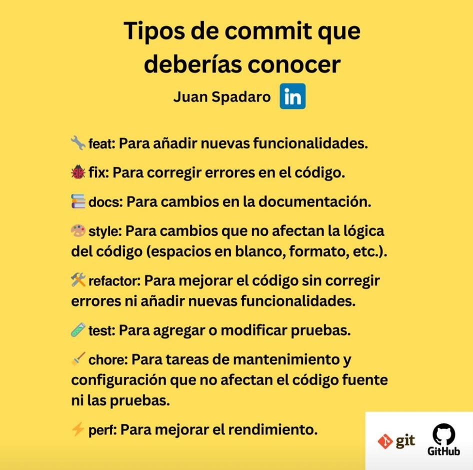

# Recursos

Este repositorio está dedicado a proporcionar una amplia variedad de recursos, herramientas y aprendizajes para desarrolladores de software.

## Indice

- [Copilot](#copilot)
- [README Generador](#readme)
- [Diseño](#design)
- [Curriculo Generador](#curriculum)
- [Juegos](#games)
- [Extensiones Chrome](#chrome)
- [Extensiones VSCode](#vscode)
- [Repositorios Github](#github)
- [Canales Youtube](#youtube)
- [Herramientas](#tools)

### Copilot 
- <a href="https://www.blackbox.ai/" target="_blank">:rocket: Black box</a>
- <a href="https://you.com/" target="_blank">:rocket: You</a>

### README Generador 
- <a href="https://gprm.itsvg.in/" target="_blank">:pencil: GPRM</a>
- <a href="https://readme.so/es" target="_blank">:pencil: Readme so</a>
- <a href="https://github.com/ikatyang/emoji-cheat-sheet" target="_blank">:pencil: Iconos</a>
- <a href="https://github.com/inttter/md-badges" target="_blank">:pencil: Badges</a>

### Diseño 
- <a href="https://thestocks.im/" target="_blank">:paintbrush: The Stockes</a>
- <a href="https://v0.dev/" target="_blank">:paintbrush: v0 By Vercel</a>
- <a href="https://collectui.com/designs" target="_blank">:paintbrush: Collect UI</a>
- <a href="https://dribbble.com/shots/4417684-Daily-UI-Landing-Page" target="_blank">:paintbrush: Dribbble</a>

### Curriculo 
- <a href="https://www.resumego.net/resume-checker/" target="_blank">:clipboard: ResumeGo</a>

### Games 
- <a href="https://checkio.org/" target="_blank">:video_game: Checkio</a>
- <a href="https://www.typing.com/es/student/game/ztype" target="_blank">:video_game: ZType</a>
- <a href="https://flexboxfroggy.com/#es" target="_blank">:apple: Flexbox Froggy</a>
- <a href="https://flukeout.github.io/" target="_blank">:apple: CSS Dinner</a>
- <a href="https://cssgridgarden.com/#es" target="_blank">:apple: Grid Garden</a>
- <a href="https://css-speedrun.netlify.app/" target="_blank">:apple: CSS Speedrun</a>
- <a href="https://layout.bradwoods.io/" target="_blank">:apple: CSS Layout generator</a>
- <a href="https://grid.layoutit.com/" target="_blank">:apple: Grid Layoutit</a>
- <a href="https://loading.io/flexbox" target="_blank">:apple: Loading.io</a>
- <a href="https://griddy.io/" target="_blank">:apple: Griddy.io</a>
- <a href="https://cssgridgenerator.io/" target="_blank">:apple: CSS Grid Generator io</a>
- <a href="https://www.mycssbuilder.com/" target="_blank">:apple: My CSS Builder</a>

### Extensiones Chrome 
- <a href="https://www.wappalyzer.com/" target="_blank">:toolbox: Wappalzer</a>
- <a href="https://seo-extension.com/" target="_blank">:toolbox: SEO Meta in 1 Click</a>
- <a href="https://visbug.web.app/" target="_blank">:toolbox: Visbug</a>
- <a href="https://www.webmobilefirst.com/es/" target="_blank">:toolbox: Simulador Movil</a>

### Extensiones VSCode 
- <a href="https://marketplace.visualstudio.com/items?itemName=ritwickdey.LiveServer" target="_blank">:keyboard: Live Server</a>
- <a href="https://marketplace.visualstudio.com/items?itemName=esbenp.prettier-vscode" target="_blank">:keyboard: Prettier</a>
- <a href="https://code.visualstudio.com/learn/collaboration/live-share" target="_blank">:keyboard: Live Share</a>

### Github repositorios 
- <a href="https://github.com/midudev" target="_blank">:computer: miduDev</a>
- <a href="https://github.com/frontend-joe" target="_blank">:computer: Frontend Joe</a>
- <a href="https://github.com/bezkoder" target="_blank">:computer: Bezkoder</a>
- <a href="https://github.com/mtdvio/every-programmer-should-know" target="_blank">:computer: mtdvio (every-programmer-should-know)</a>

### Youtube canales 
- <a href="https://www.youtube.com/@OpenBootcamp/playlists" target="_blank">:movie_camera: OpenBootcamp</a>

### Herramientas 
- <a href="https://www.ray.so/" target="_blank">:hammer: Ray.so</a>

## Util
> Prefijos para hacer commits en Git

