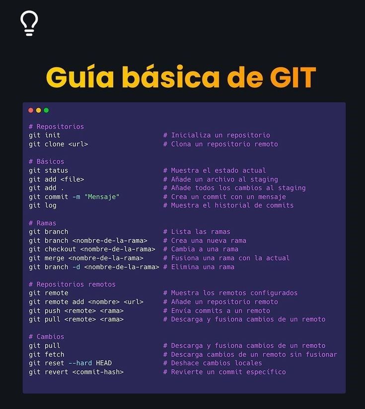
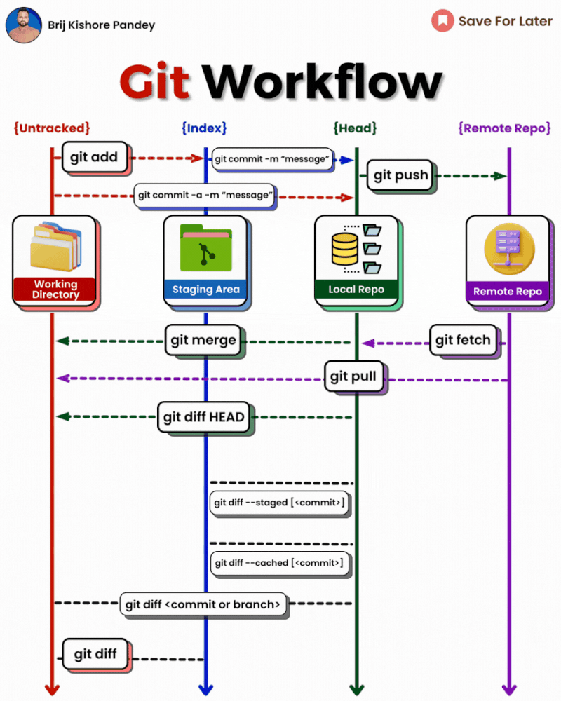
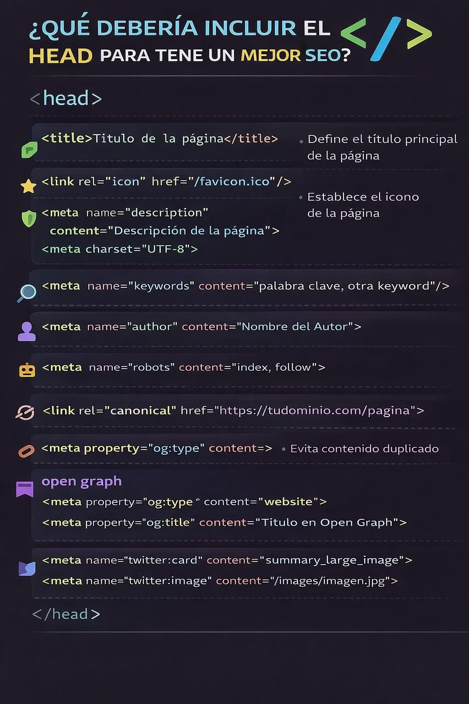
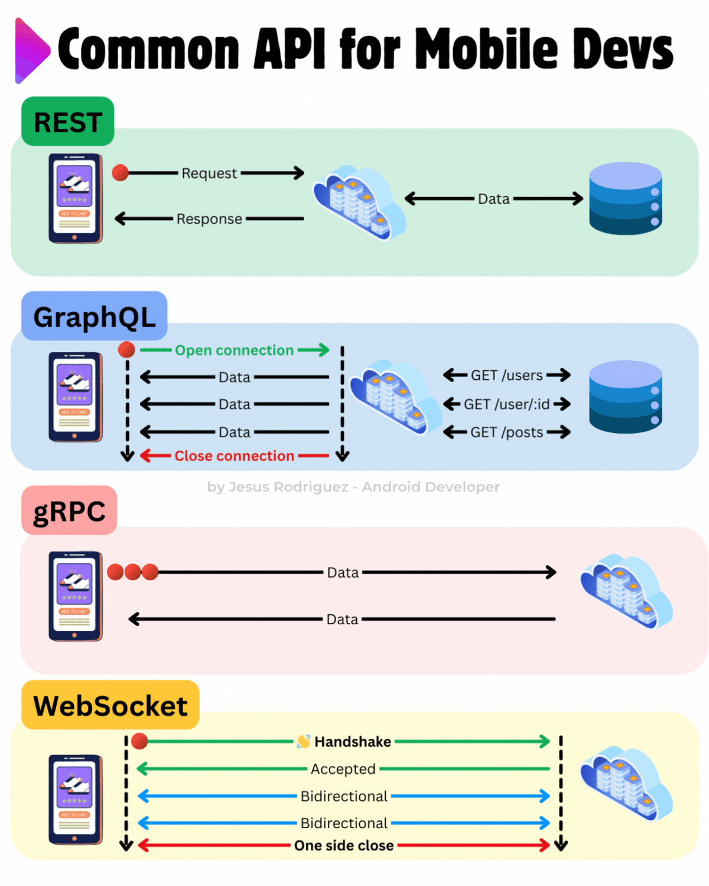
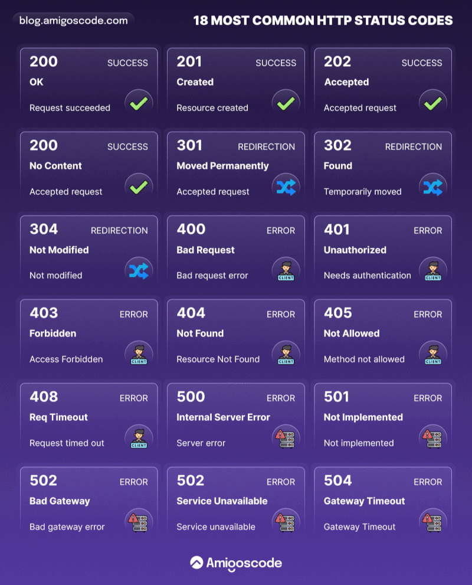
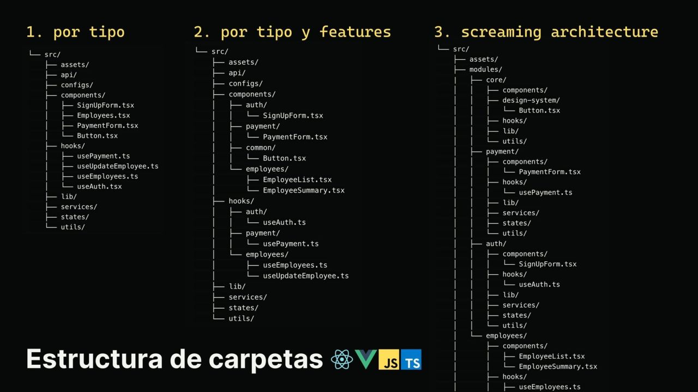
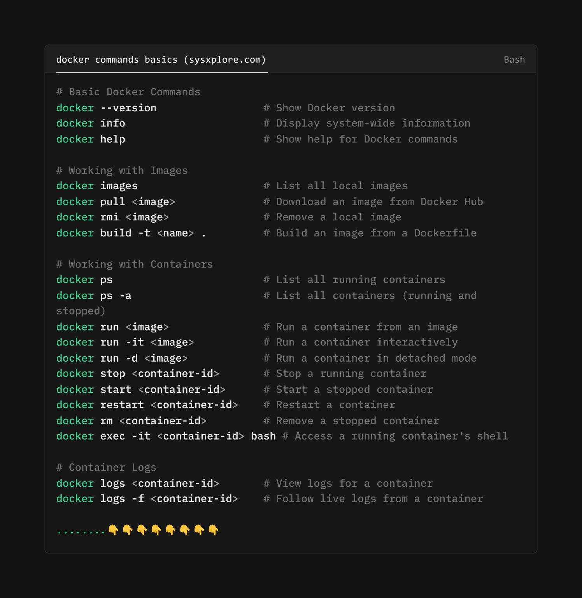
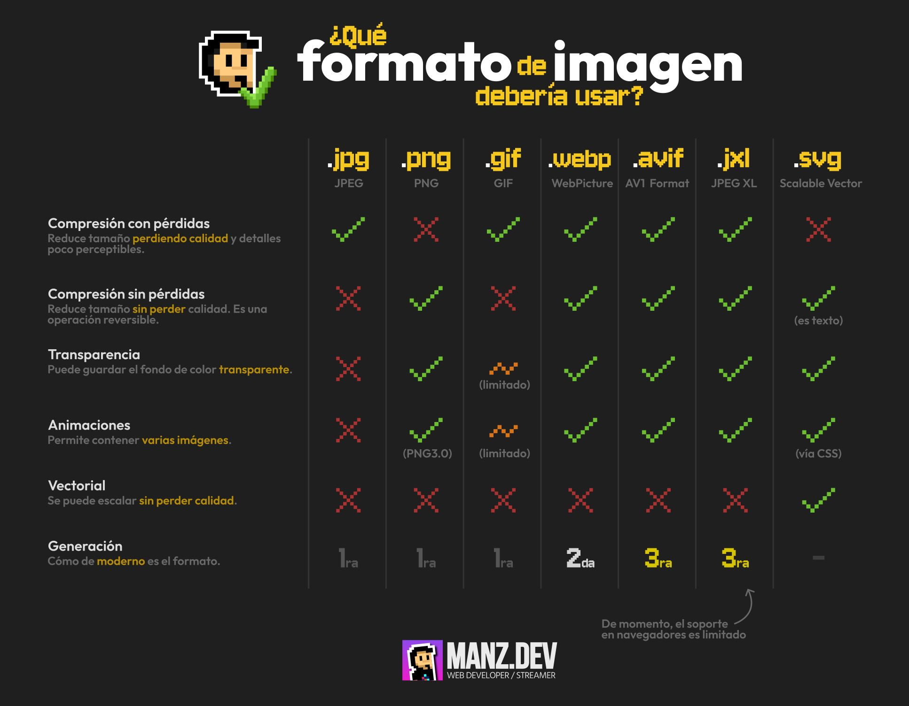

# :rocket: Recursos para Desarrolladores

Este repositorio recopila herramientas, aplicaciones, extensiones y enlaces útiles que facilitan el desarrollo de software. Aquí encontrarás también ayudas visuales para un fácil entendimiento:

## Indice

- :flying_saucer: [Generación de API's](#apis)
- :art: [Expande tus diseños](#design)
- :classical_building: [Hosting de aplicaciones](#hosting)
- :video_game: [Aprende jugando](#games)
- :loudspeaker: [Mejora tu inglés](#english)
- :man_student: [Mejora tus conocimientos](#learning)
- :bellhop_bell: [Recursos útiles para el desarrollo](#resources)
- :detective: [Aplicaciones útiles](#apps)
- :package: [Librerías útiles](#packages)
- :hammer: [Herramientas de interés](#tools)
- :page_facing_up: [Complementos para README.md](#readme)
- :clipboard: [Mejora tu currículo](#curriculum)
- :toolbox: [Extensiones útiles para el navegador](#chrome)
- :keyboard: [Extensiones útiles de VSCode](#vscode)
- :computer: [Repositorios útiles de Github](#github)
- :movie_camera: [Canales útiles de Youtube](#youtube)
- :closed_book: [Complementa con libros](#books)

### Generación de API's 

Herramientas para facilitar el desarrollo con mocks de API´s.

- :flying_saucer: [Rapid API](https://rapidapi.com/hub) - El marketplace de APIs más grande del mundo para descubrir, probar e integrar miles de endpoints en un solo lugar.
- :flying_saucer: [Public API](https://publicapis.dev/) - Un directorio indexado de APIs públicas y gratuitas para usar en tus proyectos personales o prototipos.
- :flying_saucer: [Dummy JSON](https://dummyjson.com/) - Proveedor instantáneo de datos dummy en formato JSON (usuarios, productos, posts) ideal para pruebas frontend y maquetación.

### Expande tus diseños 

Recursos visuales y herramientas de diseños para obtener creatividad.

- :art: [v0 By Vercel](https://v0.dev/) - Genera componentes de interfaz de usuario de alta fidelidad con Tailwind CSS y Shadcn UI mediante prompts de IA.
- :art: [Stitch With Google](https://stitch.withgoogle.com/?pli=1) - Herramienta de Google para inspeccionar, alinear y estructurar patrones de diseño UI consistentes.
- :art: [Readdy.ai](https://readdy.ai/) - Plataforma basada en IA para analizar tendencias estéticas y generar layouts web modernos listos para producción.
- :art: [Relume.io](https://www.relume.io/) - Generador de sitemaps y wireframes basados en componentes de Tailwind y Webflow acelerando la fase de diseño inicial.
- :art: [Toools.design](https://www.toools.design/) - Una biblioteca masiva con cientos de recursos de diseño seleccionados para desarrolladores frontend, desde iconos hasta tipografías.
- :art: [FreeSets](https://freesets.dev/) - Colección curada de plantillas visuales, kits de UI y recursos gráficos gratuitos para acelerar interfaces de usuario.
- :art: [Tailwind CSS Color Generator](https://uicolors.app/create) - Crea, previsualiza y exporta paletas de colores armónicas y accesibles directamente en formato de configuración de Tailwind.
- :art: [Coolors](https://coolors.co/) - Generador ultrarrápido de esquemas cromáticos que te permite bloquear tonalidades, explorar combinaciones y comprobar la accesibilidad del contraste.
- :art: [Kigen](https://kigen.design/color) - Herramienta minimalista para generar gradientes y paletas cromáticas optimizadas para interfaces de usuario limpias.
- :art: [WebSiteStyleKit](https://websitestylekit.com/) - Centraliza la identidad visual de tu web generando guías de estilos rápidas con fuentes, botones y colores consistentes.
- :art: [Realtime Colors](https://www.realtimecolors.com/?colors=050316-fbfbfe-56ce27-dddbff-443dff&fonts=Inter-Inter) - Previsualiza paletas de colores y fuentes aplicadas en tiempo real sobre una interfaz web real antes de escribir una sola línea de código.
- :art: [Pattern Craft](https://patterncraft.fun/) - Generador interactivo de patrones geométricos y fondos abstractos en formato CSS/SVG para tus fondos de pantalla y contenedores web.

### Hosting de aplicaciones  

- :classical_building: [Vercel]() - Despliegue optimizado con un solo clic para aplicaciones Frontend, frameworks modernos (Next.js, Angular, React) y arquitecturas Serverless.
- :classical_building: [Netlify]() - Plataforma integral de automatización para la web moderna que gestiona compilaciones, funciones serverless y hosting Jamstack global.
- :classical_building: [Render]() - Alternativa en la nube para desplegar aplicaciones Backend escritas en Express, FastAPI, bases de datos y webs estáticas sin configuraciones complejas.
- :classical_building: [FastAPI Cloud](https://dashboard.fastapicloud.com/login?redirect=%2F) - Entorno en la nube especializado y preconfigurado para el aprovisionamiento instantáneo de microservicios con FastAPI.
- :classical_building: [Superbase](https://supabase.com/) - La alternativa de código abierto a Firebase que te proporciona base de datos PostgreSQL en tiempo real, autenticación, almacenamiento de archivos y funciones Edge.
- :classical_building: [Firebase]() - Plataforma madura de Google que centraliza bases de datos NoSQL, autenticación nativa, hosting y analíticas en un ecosistema integrado.
- :classical_building: [Neon](https://neon.com/) - Servidor de bases de datos PostgreSQL serverless con escalado a cero instantáneo y capacidades avanzadas de branching de datos para desarrollo.
- :classical_building: [Xata](https://lite.xata.io/) - Base de datos PostgreSQL serverless con una interfaz amigable e intuitiva estilo hoja de cálculo y motor de búsqueda de texto completo integrado.
- :classical_building: [Cockrachlabs](https://www.cockroachlabs.com/) - Base de datos SQL distribuida de arquitectura nativa en la nube (Cloud-Native), diseñada para una consistencia de datos indestructible y alta disponibilidad global.
- :classical_building: [MongoDB Atlas](https://account.mongodb.com/account/login?nds=true) - Base de datos NoSQL documental gestionada en la nube con herramientas integradas de analítica, búsqueda vectorial y escalado global automatizado.
- :classical_building: [Turso](https://turso.tech/) - Base de datos relacional distribuida basada en libSQL (fork de SQLite) optimizada para tiempos de respuesta ultra bajos y arquitecturas en el borde (Edge).
- :classical_building: [Dokploy](https://dokploy.com/) - Panel de control autohospedado para administrar tus propios servidores VPS mediante Docker, actuando como tu propio Heroku o Render privado.
- :classical_building: [Zeabur](https://zeabur.com/es-ES/) - Hosting global automatizado multilenjuaje y multiframework que despliega servicios frontend, backend y bases de datos con cero fricción de infraestructura.
- :classical_building: [Koyeb](https://www.koyeb.com/) - Plataforma de despliegue serverless de alto rendimiento que corre tus contenedores Docker globalmente en milisegundos con soporte nativo de microservicios.
- :classical_building: [Northflank](https://northflank.com/) - Plataforma para desarrolladores que permite compilar, desplegar y escalar aplicaciones backend, microservicios, tareas programadas y bases de datos (ofrece un nivel de entrada con dos servicios gratuitos).

### Aprende jugando 

Aprende y mejora tus habilidades de desarrollo jugando.

- :video_game: [Checkio](https://checkio.org/) - Resuelve desafíos algorítmicos complejos programando en Python y TypeScript dentro de un entorno de juego por misiones.
- :video_game: [Codedex](https://www.codedex.io/) - Aventura RPG interactiva en 2D diseñada para aprender los fundamentos de HTML, CSS, Python y JavaScript desde cero absoluto.
- :video_game: [ZType](https://www.typing.com/es/student/game/ztype) - Arcade espacial de disparos donde destruyes naves enemigas escribiendo rápido, ideal para mejorar tu velocidad de mecanografía al programar.
- :video_game: [Typing Club](https://www.typingclub.com/) - Tutor interactivo paso a paso para dominar la técnica de digitación al tacto (touch typing) sin mirar el teclado, aumentando tu productividad.
- :video_game: [LearnGitBranching](https://learngitbranching.js.org/?locale=es_ES) - La guía visual interactiva definitiva para dominar ramas, rebasados y fusiones en Git mediante simulaciones en una consola virtual.
- :video_game: [Git Junior Dev](https://gitjunior.dev/) - Simulador de entorno de trabajo real donde resuelves conflictos y solicitudes de cambios de código (PRs) cotidianos mediante comandos de Git.
- :video_game: [Play with Docker](https://labs.play-with-docker.com/) - Laboratorio interactivo basado en navegador que te ofrece una terminal Linux gratuita para experimentar con contenedores y clusters de Docker de forma segura.
- :video_game: [Flexbox Froggy](https://flexboxfroggy.com/#es) - El clásico juego de lógica visual donde guías a ranas hacia sus lirios escribiendo código CSS Flexbox correcto.
- :video_game: [CSS Dinner](https://flukeout.github.io/) - Un banquete interactivo de niveles progresivos dedicado exclusivamente a dominar los selectores avanzados de CSS.
- :video_game: [Grid Garden](https://cssgridgarden.com/#es) - Cultiva tu propio jardín digital y domina por completo las propiedades complejas de diseño bidimensional con CSS Grid.
- :video_game: [Flexbox Defense](http://www.flexboxdefense.com/) - Videojuego de defensa de torres donde posicionas estratégicamente tus torretas defensivas utilizando alineaciones de CSS Flexbox.
- :video_game: [Flexbox Zombies](https://mastery.games/post/flexboxzombies2/) - Un videojuego narrativo inmersivo con una estética cuidada para entrenar tu cerebro en las mecánicas profundas de Flexbox.
- :video_game: [The farmer was replaced](https://thefarmerwasreplaced.com/) - Videojuego de automatización donde controlas y optimizas las tareas de un dron agricultor programando su comportamiento con scripts en Python.
- :video_game: [Code pip](https://codepip.com/games/) - Colección premium de minijuegos diseñados para pulir tus habilidades de maquetación avanzada utilizando Flexbox, Grid y utilidades de Tailwind CSS.
- :video_game: [CodinGame](https://www.codingame.com/start/) - Colección premium de minijuegos diseñados para pulir tus habilidades en Python y JS.
- :video_game: [Warriors.JS](https://warrior.js.org/) - Colección premium de minijuegos diseñados para pulir tus habilidades en JS.
- :video_game: [LightBOT](https://lightbot.com/) - Colección premium de minijuegos diseñados para pulir tus habilidades en logica de programacion.

### Mejora tu ingles 

Apliaciones o certificados para mejorar y validar tu Ingles.

- :loudspeaker: [Certificación EF SET](https://www.efset.org/) - Examen de inglés estandarizado y gratuito de 50 minutos con certificado digital alineado a los niveles oficiales del MCER (A1-C2).
- :loudspeaker: [Certificación A2](https://www.freecodecamp.org/espanol/learn/a2-english-for-developers/) - Plan de estudios de nivel básico-intermedio enfocado en situaciones profesionales del desarrollo técnico y comunicación con clientes internacionales.
- :loudspeaker: [Certificación B1](https://www.freecodecamp.org/espanol/learn/b1-english-for-developers/) - Programa intermedio diseñado específicamente para la interacción fluida en metodologías ágiles, revisiones de código y reuniones de ingeniería de software.
- :loudspeaker: [Vocabulario](https://www.languageguide.org/) - Diccionario visual interactivo de vocabulario técnico e idiomático para mejorar la retención auditiva y contextualización léxica.
- :loudspeaker: [Conversaciones](https://tandem.net/es) - Comunidad global de intercambio de idiomas que te conecta con desarrolladores nativos de habla inglesa para practicar mediante texto, audio y videollamadas.
- :loudspeaker: [Curso ingles](https://curso-ingles.com/) - Plataforma estructurada con lecciones gramaticales exhaustivas, ejercicios prácticos y exámenes de control organizados por niveles.
- :loudspeaker: [BBC Learning English](https://www.bbc.co.uk/learningenglish) - Recurso oficial de la BBC con contenidos multimedia, podcasts interactivos de actualidad y ejercicios diarios para refinar tu comprensión auditiva.
- :loudspeaker: [English Practice Test](https://englishpracticetest.net/) - Repositorio de exámenes simulados cronometrados ideales para medir tu nivel antes de someterte a certificaciones internacionales oficiales.
- :loudspeaker: [English Listening Lesson Library Online](https://elllo.org/) - Archivo de audio masivo con miles de grabaciones en inglés nativo clasificadas por acentos, temas y niveles de dificultad con transcripciones en tiempo real.

### Mejora tus conocimientos 

Aplicaciones o sitios web para estudiar y aprender de programacion.

- :man_student: [Certiprof](https://free.certiprof.com/) - Acceso a exámenes de certificación profesional sin costo, abarcando marcos ágiles como Scrum Master, metodologías DevOps y fundamentos tecnológicos.
- :man_student: [Github](https://examregistration.github.com/) - Portal oficial de certificación técnica de GitHub para validar tus conocimientos de nivel avanzado en Git, GitHub Actions y seguridad de repositorios.
- :man_student: [Freecodecamp](https://www.freecodecamp.org/espanol/learn/) - Plan de estudios interactivo basado en la web y totalmente gratuito, estructurado en certificaciones que abarcan desde algoritmos básicos hasta arquitecturas backend distribuidas.
- :man_student: [Cursos desafio latam](https://cursos.desafiolatam.com/collections) - Programas educativos y bootcamps enfocados en habilidades de alta demanda tecnológica para impulsar la inserción laboral de desarrolladores en Latinoamérica.
- :man_student: [Dev challenges](https://devchallenges.io/) - Plataforma de aprendizaje basada en proyectos prácticos reales que simulan flujos de trabajo profesionales en desarrollo frontend, backend y full-stack.
- :man_student: [Cognitives Class](https://cognitiveclass.ai/) - Cursos especializados de IBM sobre Ciencia de Datos, Inteligencia Artificial, computación en la nube, arquitecturas Big Data y desarrollo de software empresarial con acceso gratuito a entornos de laboratorio reales.
- :man_student: [VSCode Education](https://vscodeedu.com/courses) - Cursos interactivos integrados diseñados por Microsoft para dominar la programación de software directamente desde entornos interactivos escolares y de formación.
- :man_student: [Leetcode](https://leetcode.com/) - La plataforma líder para practicar algoritmos, estructuras de datos y resolución de problemas técnicos complejos esenciales para superar entrevistas técnicas corporativas (FAANG).
- :man_student: [Front End Interview Handbook](https://www.frontendinterviewhandbook.com/) - Guía analítica exhaustiva con respuestas estructuradas a preguntas frecuentes de entrevistas técnicas sobre JavaScript, HTML, CSS y rendimiento web.
- :man_student: [Freecodecamp Github](https://github.com/freeCodeCamp/freeCodeCamp) - El repositorio de código abierto más grande del mundo donde puedes contribuir al código base de freeCodeCamp, aprender desarrollo comunitario y entender flujos Git a escala masiva.
- :man_student: [OverAPIb](https://overapi.com/) - Un índice centralizado de hojas de trucos (cheat sheets) ultracompletas de casi todos los lenguajes de programación, librerías y entornos de desarrollo.

### Recursos útiles para el desarrollo  

Aplicaciones o recursos que facilitan el desarrollo de codigo.

- :bellhop_bell: [Desig.md](https://designmd.me/) - Extrae de forma limpia el marcado, estructura e intenciones de diseño de cualquier sitio web convirtiéndolo a Markdown optimizado para el contexto de Inteligencias Artificiales.
- :bellhop_bell: [Public Apis](https://publicapis.dev/) - Un catálogo masivo de APIs públicas organizadas detalladamente con información sobre autenticación, soporte HTTPS y CORS.
- :bellhop_bell: [Skelementor](https://skelementor.com/) - Kit de wireframing y bloques estructurales listos para copiar y pegar directamente en Elementor para WordPress, acelerando el prototipado visual.
- :bellhop_bell: [font Awesome](https://fontawesome.com/) - La librería de iconos vectoriales y fuentes más popular de la industria con miles de glifos escalables y personalizables vía CSS.
- :bellhop_bell: [Lucide Icons](https://lucide.dev/icons/) - Colección moderna de iconos vectoriales consistentes, ultraligeros y de código abierto optimizados de forma nativa para React, Vue y Angular.
- :bellhop_bell: [All SVG Icons](https://allsvgicons.com/) - Directorio abierto con descargas instantáneas de iconos vectoriales limpios listos para código fuente o herramientas de diseño UI.
- :bellhop_bell: [Icons0](https://icons0.dev/) - Buscador de sets de iconos minimalistas optimizados para pantallas de alta densidad y interfaces web elegantes.
- :bellhop_bell: [Google Fonts](https://fonts.google.com/) - El catálogo oficial e interactivo de fuentes tipográficas e iconos open-source de Google optimizados para su entrega ultrarrápida vía CDN.
- :bellhop_bell: [Croll Bar](https://scrollbar.app/) - Generador visual de estilos CSS personalizados para barras de desplazamiento web transversales a diferentes navegadores modernos.
- :bellhop_bell: [Python Tutor](https://pythontutor.com/) - Herramienta interactiva que visualiza la ejecución de tu código paso a paso, mostrando el estado exacto de variables, punteros y la pila de memoria (Stack/Heap) en Python, JavaScript y C.
- :bellhop_bell: [Lenguajecss](https://lenguajecss.com/css/funciones-css/referencia/) - Guía enciclopédica detallada en español sobre todas las funciones, selectores y propiedades nativas del estándar CSS.
- :bellhop_bell: [Git Ignore](https://www.toptal.com/developers/gitignore) - Genera automáticamente archivos `.gitignore` limpios y precisos basados en tu sistema operativo, IDE y frameworks específicos seleccionados.
- :bellhop_bell: [Free for dev](https://free-for.dev/#/) - Lista curada de servicios en la nube (SaaS, PaaS, IaaS) con niveles gratuitos permanentes diseñados expresamente para ingenieros de software.
- :bellhop_bell: [Awesome](https://github.com/sindresorhus/awesome) - El repositorio de repositorios de GitHub: listas exhaustivas sobre tecnologías, frameworks, metodologías y guías de arquitectura de software.
- :bellhop_bell: [IT-Tools](https://it-tools.tech/) - Navaja suiza digital que reúne decenas de utilidades indispensables para desarrolladores (codificadores JSON, hashes criptográficos, generadores de UUID y conversores de fecha).
- :bellhop_bell: [Ray.so](https://www.ray.so/) - Transforma fragmentos de código fuente plano en capturas de pantalla estilizadas con fondos degradados listos para compartir en redes o documentación técnica.
- :bellhop_bell: [Regex101](https://regex101.com/) - Entorno interactivo para escribir, probar, depurar y analizar expresiones regulares complejas con explicaciones detalladas de coincidencia de patrones en tiempo real.
- :bellhop_bell: [JSON Generator](https://www.jsongenerator.io/) - Generador dinámico de estructuras de datos JSON complejas utilizando plantillas sintácticas personalizables para simular grandes volúmenes de información.
- :bellhop_bell: [JSON Data AI](https://www.jsondataai.com/) - Genera esquemas de bases de datos y payloads JSON coherentes a partir de descripciones textuales en lenguaje natural impulsadas por IA.
- :bellhop_bell: [Retool](https://retool.com/api-generator) - Genera de forma instantánea endpoints REST funcionales a partir de esquemas JSON para agilizar el mocking y pruebas frontend.
- :bellhop_bell: [Mockaroo](https://mockaroo.com/) - Plataforma industrial para generar hasta millones de registros de datos ficticios en formatos CSV, JSON, SQL o Excel para pruebas de rendimiento de bases de datos.
- :bellhop_bell: [JSON Crack](https://jsoncrack.com/editor) - Transforma de forma gráfica estructuras de datos JSON anidadas y oscuras en diagramas interactivos de nodos visuales legibles al instante.
- :bellhop_bell: [Squoosh](https://squoosh.app/) - Optimizador de imágenes web desarrollado por Google que compara en tiempo real compresión avanzada (WebP, AVIF) reduciendo drásticamente el peso de carga de tu sitio.
- :bellhop_bell: [CSS Code Quality](https://www.projectwallace.com/css-code-quality) - Analizador estático avanzado que escanea tus archivos CSS para auditar su complejidad, selectores duplicados, rendimiento y adherencia a buenas prácticas de código.
- :bellhop_bell: [PageSpeed Insights](https://pagespeed.web.dev/) - Herramienta oficial de Google que audita el rendimiento web móvil y de escritorio, arrojando métricas clave de Core Web Vitals y recomendaciones accionables.
- :bellhop_bell: [Pingdom](https://tools.pingdom.com/) - Analizador global de velocidad de carga que desgrana la cascada completa de peticiones HTTP (scripts, imágenes, fuentes) de tu sitio web identificando cuellos de botella.
- :bellhop_bell: [Web Check](https://web-check.xyz/) - Herramienta de inteligencia de arquitectura que analiza de forma exhaustiva la infraestructura de cualquier sitio web: DNS, cabeceras de seguridad, certificados SSL, tecnologías backend y hosting.
- :bellhop_bell: [SEO Test](https://seotest.me/) - Auditor web que escanea la estructura interna de tus páginas proporcionando un informe ágil de errores de indexabilidad y metatags faltantes.
- :bellhop_bell: [SEO Meta](https://seomator.com/) - Suite de análisis web completo enfocado en el posicionamiento orgánico, optimización de contenidos en buscadores y enlazado interno de código HTML.
- :bellhop_bell: [Backlinko](https://backlinko.com/tools/seo-checker) - Herramienta de diagnóstico SEO enfocada en la optimización on-page, análisis de velocidad y estructura semántica para mejorar el posicionamiento en motores de búsqueda.
- :bellhop_bell: [Wave](https://wave.webaim.org/) - Extensión y suite web de accesibilidad digital que evalúa tus interfaces web para asegurar el cumplimiento estricto de las pautas WCAG (contraste, etiquetas ARIA, lectores de pantalla).
- :bellhop_bell: [Run SQL](https://runsql.com/r) - Consola de bases de datos online para ejecutar consultas SQL rápidas, validar lógica de consultas y probar esquemas relacionales sin levantar un motor local.
- :bellhop_bell: [ChartDB](https://app.chartdb.io/) - Generador moderno de diagramas entidad-relación (ERD) que convierte esquemas de bases de datos complejos en diagramas interactivos visuales editables.
- :bellhop_bell: [DB Diagram](https://dbdiagram.io/home/) - Herramienta ágil orientada a desarrolladores que renderiza diagramas de bases de datos relacionales escribiendo código simple basado en sintaxis declarativa (DBML).
- :bellhop_bell: [DrawDB](https://www.drawdb.app/) - Editor de diagramas de bases de datos relacionales basado en navegador, intuitivo, potente y con exportación de scripts SQL DDL listos para producción.
- :bellhop_bell: [Database Build](https://database.build/) - Entorno interactivo para concebir, diseñar visualmente y estructurar esquemas arquitectónicos de bases de datos relacionales desde el navegador de manera colaborativa.
- :bellhop_bell: [Excalidraw](https://excalidraw.com/) - Pizarra virtual con estética de dibujo a mano alzada perfecta para esquematizar diagramas de flujo rápidos, wireframes básicos y explicaciones técnicas de arquitectura.
- :bellhop_bell: [Rapid Charts](https://www.rapidcharts.ai/) - Generador impulsado por IA que convierte conjuntos de datos crudos en gráficos estadísticos y flujos visuales interactivos integrables en aplicaciones web.
- :bellhop_bell: [Brainboard](https://www.brainboard.co/) - Plataforma colaborativa avanzada donde diseñas visualmente arquitecturas en la nube (AWS, Azure, GCP) y el sistema genera automáticamente el código de infraestructura correspondiente (Terraform).
- :bellhop_bell: [FossFLOW](https://stan-smith.github.io/FossFLOW/) - Herramienta open-source ágil orientada a la creación rápida de diagramas técnicos de flujo de procesos de software libres de marcas comerciales.
- :bellhop_bell: [Mermaid](https://mermaid.ai/web/) - Editor en vivo que renderiza complejos diagramas de flujo, diagramas de secuencia e infraestructura técnica interpretando texto plano con sintaxis Markdown nativa.
- :bellhop_bell: [Real Favicon Generator .Net](https://realfavicongenerator.net/) - Suite definitiva para generar iconos de sitios web que compila y adapta tu imagen a todos los formatos y tamaños requeridos por navegadores, iOS, Android y Windows.
- :bellhop_bell: [Errores](https://erroresapp.vercel.app/) - Glosario estructurado de documentación técnica que compila soluciones y análisis de las excepciones de programación más comunes.
- :bellhop_bell: [Commandos](https://commandsapp.vercel.app/) - Repositorio de referencia interactivo con trucos y comandos esenciales listos para consolas Bash, Git, Docker y terminales de desarrollo.
- :bellhop_bell: [CSS Grid Generator io](https://cssgridgenerator.io/) - Interfaz visual e interactiva para estructurar layouts complejos con CSS Grid, exportando el código HTML y CSS maquetado al instante.
- :bellhop_bell: [SQLite Viewer](https://sqliteviewer.app/) - Lector e inspector ligero basado en navegador web para abrir, consultar y visualizar archivos de bases de datos SQLite locales sin instalar software extra.
- :bellhop_bell: [Good Firts Issue](https://goodfirstissue.dev/) - Plataforma curada que filtra bugs y tareas de baja complejidad en proyectos de código abierto de GitHub para ayudar a desarrolladores junior a realizar sus primeras contribuciones.
- :bellhop_bell: [W3 School - HTML Chartes](https://www.w3schools.com/charsets/default.asp) - Tabla de referencia oficial con todos los códigos de caracteres, entidades HTML, emojis y símbolos codificados para su correcta visualización en navegadores.
- :bellhop_bell: [Deep Wiki](https://deepwiki.org/) - Motor de búsqueda y documentación mejorada enfocado en desglosar de manera lógica la estructura interna de repositorios de software complejos de GitHub.
- :bellhop_bell: [CodeSandbox](https://codesandbox.io/templates) - Entorno de desarrollo en la nube (Cloud IDE) con plantillas preconfiguradas para codificar, previsualizar en vivo y compartir prototipos web completos en segundos.
- :bellhop_bell: [Caninclude](https://caninclude.onrender.com/) - Validador rápido de especificaciones HTML que comprueba de forma semántica si una etiqueta específica puede anidarse legalmente dentro de otra de acuerdo a los estándares de la W3C.
- :bellhop_bell: [Mark Map](https://markmap.js.org/repl) - Transforma archivos Markdown jerárquicos y archivos README planos en mapas mentales interactivos visuales basados en ramas semánticas.
- :bellhop_bell: [Local Stack](https://www.localstack.cloud/) - Emulador local ultracompleto de servicios de Amazon Web Services (AWS) que te permite correr Lambdas, S3 y DynamoDB localmente en tu máquina sin incurrir en costes de infraestructura.
- :bellhop_bell: [Floci IO](https://floci.io/) - Plataforma ágil de desarrollo local para modelar arquitecturas nativas de nube distribuidas minimizando latencias y costes de testing en la nube real.

### Aplicaciones útiles 

Aplicaciones para desarrollar software.

- :detective: [VSCode](https://code.visualstudio.com/) - El editor de código extensible líder de la industria desarrollado por Microsoft, equipado con un ecosistema masivo de plugins y terminal integrada.
- :detective: [Postman](https://www.postman.com/) - Plataforma integral de desarrollo de APIs utilizada para construir, probar de forma automatizada, documentar y simular endpoints REST, GraphQL y gRPC.
- :detective: [UrbanVPN](https://www.urban-vpn.com/) - Cliente VPN gratuito para simular accesos geográficos de red, testear configuraciones de CDN internacionales y sortear restricciones de cortafuegos durante pruebas locales.
- :detective: [Git](https://git-scm.com/downloads) - El estándar mundial e indispensable de sistema de control de versiones distribuido diseñado para gestionar el historial de código con velocidad y eficiencia.
- :detective: [NVM](https://github.com/nvm-sh/nvm) - Gestor de versiones de Node.js que te permite instalar, alternar y aislar múltiples entornos de ejecución de JavaScript por consola de acuerdo al proyecto.
- :detective: [UV](https://github.com/astral-sh/uv) - Gestor de paquetes de Python ultrarrápido escrito en Rust que reemplaza a `pip` y `poetry`, optimizando drásticamente la instalación de dependencias en tus proyectos backend.
- :detective: [Ngrok](https://ngrok.com/) - Expone de forma instantánea servidores web locales de tu máquina (por ejemplo, `localhost:8000`) a internet mediante túneles seguros cifrados, ideal para probar webhooks y demos en móviles.
- :detective: [DbGate](https://github.com/dbgate/dbgate) - Administrador de bases de datos relacionales y NoSQL multiplataforma y de código abierto, diseñado para operar fluidamente con grandes colecciones de datos.
- :detective: [GitHub CLI](https://cli.github.com/) - Lleva todo el flujo de trabajo colaborativo de GitHub (gestión de Pull Requests, Issues, Actions y Releases) directamente al control de tu terminal de comandos.
- :detective: [Obsidian](https://obsidian.md/) - Potente base de conocimiento personal basada en archivos Markdown locales que utiliza un gráfico de enlaces de nodos, ideal para documentar arquitecturas y flujos de lógica.

### Librerías útiles  

Librerias NPM de gran interes o utiles.

- :package: [npkill](https://www.npmjs.com/package/npkill) - Comando interactivo que escanea tu sistema local para listar y purgar carpetas `node_modules` antiguas, liberando gigabytes de espacio en tu disco en segundos.
- :package: [CodeGraph](https://github.com/colbymchenry/codegraph) - Analizador de código estático que mapea las relaciones de un proyecto de software y genera grafos visuales estructurados óptimos para dar contexto a Inteligencias Artificiales.
- :package: [Repomix](https://github.com/yamadashy/repomix) - Herramienta CLI de empaquetado que unifica todo el árbol de directorios de un proyecto JavaScript/TypeScript en un único archivo markdown legible optimizado para Large Language Models (LLMs).
- :package: [Code Review Map](https://github.com/tirth8205/code-review-graph) - Librería analítica para código estructurado en Python que mapea las interdependencias de módulos funcionales y clases, facilitando auditorías de arquitectura asistidas por IA.
- :package: [Graphify](https://github.com/safishamsi/graphify) - Herramienta de abstracción que convierte bases de código Python complejas en redes estructuradas de grafos relacionales lógicos comprensibles para motores de IA.

### Herramientas de interés 

Herramientas adicionales para mejorar tu flujo de trabajo.

- :hammer: [Keyboard Gif](https://keyboardapp-brown.vercel.app/) - Generador web que graba y exporta animaciones GIF personalizadas de pulsaciones de teclado en tiempo real, ideal para videotutoriales técnicos.
- :hammer: [Google Earth Studio](https://www.google.com/earth/studio/) - Herramienta de animación en el navegador basada en imágenes 3D y satelitales de Google Earth para crear renders y trayectorias de cámaras profesionales.
- :hammer: [Mult.dev](https://mult.dev/es) - Genera animaciones de mapas interactivos estilizados para documentar rutas geográficas y trayectos de viajes con un acabado gráfico limpio.
- :hammer: [Shadow Map](https://shadowmap.org/es/) - Simulador interactivo en 3D del comportamiento de la luz solar y sombras en cualquier ubicación geográfica real del planeta y en cualquier hora exacta del día.
- :hammer: [OBS Studio](https://obsproject.com/download) - Software open-source líder en la industria para grabación de pantalla de alta definición y transmisión de vídeo en directo con control multicanal.
- :hammer: [Renderforest](https://hix.ai/home) - Suite integrada impulsada por IA enfocada en la creación rápida de material multimedia, branding digital, animaciones e interfaces maquetadas.
- :hammer: [UnDraw](https://undraw.co/illustrations) - Galería de ilustraciones vectoriales minimalistas en formato SVG de uso libre, con la opción integrada de personalizar la paleta de color web corporativa.
- :hammer: [unSplash](https://unsplash.com/es) - La plataforma de fotografía de alta resolución gratuita más grande de la web, ideal para recursos visuales de desarrollo en producción o banners publicitarios.
- :hammer: [Shots](https://shots.so/) - Generador de maquetas y mockups estéticos que enmarca capturas de pantalla de tu software dentro de dispositivos (iPhone, Mac, monitores) con fondos personalizables.
- :hammer: [Rising Stars](https://risingstars.js.org/2025/en) - Informe analítico anual exhaustivo que recopila y evalúa los proyectos de código abierto del ecosistema JavaScript que han experimentado un mayor crecimiento en tendencias de GitHub.
- :hammer: [Yoodli](https://yoodli.ai/) - Simulador privado de entrevistas asistido por IA que evalúa tu comunicación verbal, velocidad al hablar y muletillas de lenguaje, optimizando tu desempeño para entrevistas laborales globales.

### Complementos para README.md 

Generadores para crear tu README de manera rápida y profesional.

- :page_facing_up: [GPRM](https://gprm.itsvg.in/) - Generador visual interactivo que automatiza la creación de perfiles estéticos de GitHub, integrando contadores de visitas, badges dinámicos y estadísticas en tiempo real.
- :page_facing_up: [GH Profile Readme](https://rahuldkjain.github.io/gh-profile-readme-generator/) - Herramienta basada en formularios técnicos para añadir iconos de habilidades, redes sociales, estadísticas avanzadas y extensiones dinámicas a tu README.
- :page_facing_up: [Profile Readme Generator](https://profile-readme-generator.com/es) - Diseñador ágil de portafolios nativos para perfiles de GitHub mediante la selección modular de tecnologías, badges de frameworks y repositorios destacados.
- :page_facing_up: [Readme so](https://readme.so/es) - Editor interactivo con interfaz "arrastrar y soltar" (drag-and-drop) de secciones predefinidas que simplifica radicalmente la escritura de archivos README estructurados para proyectos open-source.
- :page_facing_up: [Iconos](https://github.com/ikatyang/emoji-cheat-sheet) - Hoja de referencia de códigos abreviados de emojis compatibles de forma nativa para estructurar visualmente tus ficheros Markdown en GitHub.
- :page_facing_up: [Emojis](https://tutorialmarkdown.com/emojis) - Guía en español con buenas prácticas de legibilidad y trucos de sintaxis para renderizar emojis consistentes en tus archivos técnicos.
- :page_facing_up: [Badges](https://github.com/inttter/md-badges) - Colección masiva de códigos limpios listos para copiar que añaden insignias (badges) estilizadas de lenguajes de programación, herramientas de desarrollo y redes sociales.
- :page_facing_up: [Docs](https://docs.github.com/es/get-started/writing-on-github/getting-started-with-writing-and-formatting-on-github/basic-writing-and-formatting-syntax) - Manual técnico de referencia oficial de GitHub que detalla la sintaxis exacta recomendada para dar formato de texto, tablas y bloques de código a documentos `.md`.

### Mejora tu curriculo 

Herramientas para generar tu currículum profesional.

- :clipboard: [ResumeGo](https://www.resumego.net/resume-checker/) - Evaluador analítico que escanea la redacción de tu currículum proporcionando métricas de impacto semántico y consejos de optimización frente a perfiles competitivos de TI.
- :clipboard: [Resume](https://resmume.com/resume-ats-checker/) - Herramienta de validación técnica que comprueba si tu CV cumple con los estándares estrictos de legibilidad sintáctica de los sistemas automatizados de filtrado ATS corporativos.
- :clipboard: [AI Apply](https://aiapply.co/) - Genera currículums técnicos adaptados, cartas de presentación y perfiles profesionales específicos a partir de la descripción de ofertas de empleo de ingeniería de software.
- :clipboard: [Jobscan](https://www.jobscan.co/) - Compara el texto exacto de tu CV frente a una oferta laboral de ingeniería de software concreta, midiendo el porcentaje de coincidencia de palabras clave críticas de tu perfil técnico.
- :clipboard: [Resume Worded](https://resumeworded.com/index.php) - Plataforma de retroalimentación instantánea desarrollada por reclutadores técnicos que califica de forma automatizada tu CV y tu perfil de LinkedIn.
- :clipboard: [CV Jet](https://cvjet.co/ats-checker) - Analizador estático de currículums diseñado para identificar errores invisibles de maquetación, tipografías inválidas o secciones ilegibles para los robots ATS de contratación global.
- :clipboard: [EnhanCV](https://app.enhancv.com/) - Diseñador interactivo de currículums profesionales enfocado en el sector de la tecnología, equipado con verificadores internos de redacción de alto impacto.
- :clipboard: [Genera CV](https://www.generacv.cl/) - Herramienta en línea que simplifica el vaciado de datos profesionales e historial de proyectos de ingeniería para generar formatos PDF limpios y estandarizados.
- :clipboard: [OverLeaf](https://www.overleaf.com/) - Editor colaborativo en la nube basado en el lenguaje tipográfico LaTeX, la opción predilecta de ingenieros de software para compilar CVs indestructibles frente a lectores ATS.

### Extensiones útiles para el navegador 

Extensiones útiles para el navegador Chrome.

- :toolbox: [Wappalzer]() - Detector instantáneo de tecnologías web que identifica frameworks frontend, lenguajes backend, servicios de analítica, gestores de bases de datos y CDNs de cualquier sitio web activo.
- :toolbox: [SEO Meta in 1 Click]() - Extensión de análisis técnico que extrae e inspecciona de forma inmediata todos los metatags de SEO, jerarquía de encabezados (H1-H6), imágenes sin ALT y datos estructurados de una URL.
- :toolbox: [Visbug]() - Herramienta de diseño interactivo de código abierto para navegadores web que permite inspeccionar, modificar estilos, mover elementos y testear layouts sobre el DOM activo sin reescribir código CSS.
- :toolbox: [Simulador Movil]() - Entorno de pruebas integrado que simula con alta fidelidad pantallas de dispositivos móviles y tablets con sus respectivas resoluciones nativas, orientaciones y tasas de refresco.
- :toolbox: [ColorZilla]() - Cuentagotas digital avanzado y selector de color integrado en el navegador que copia códigos HEX/RGB del DOM al portapapeles y lee degradados web complejos.
- :toolbox: [html.to.design]() - Convierte cualquier página web real en capas de diseño vectoriales editables y totalmente estructuradas dentro de Figma en cuestión de segundos.
- :toolbox: [Lighthouse]() - Herramienta de automatización integrada desarrollada por Google que genera reportes profundos sobre rendimiento, accesibilidad, prácticas de código recomendadas y optimización SEO en entornos productivos.
- :toolbox: [GoFullPage]() - Captura de pantalla completa y limpia de páginas web de arriba a abajo en alta fidelidad, exportando el resultado directamente en formato PDF o imagen PNG.
- :toolbox: [Meta Explorer]() - Extensión analítica especializada en rastrear, depurar y validar la correcta implementación de etiquetas de Open Graph y Twitter Cards integradas en el código fuente HTML.
- :toolbox: [CSS Peeper]() - Inspector visual de CSS enfocado en diseñadores y desarrolladores frontend que aísla elementos web para extraer colores, tipografías y recursos gráficos empaquetados sin abrir la consola de desarrollo.
- :toolbox: [WhatFont]() - La forma más rápida de identificar fuentes tipográficas en la web; basta con pasar el cursor sobre cualquier texto para conocer la familia, tamaño, peso y color CSS aplicado.
- :toolbox: [CSS Scan]() - Extensión premium de inspección que muestra todo el código CSS de cualquier componente web al pasar el ratón por encima, permitiendo copiar el set de reglas completo con un solo clic.
- :toolbox: [BrowserStack]() - Conexión instantánea a dispositivos móviles y configuraciones de navegadores reales en la nube para auditar la compatibilidad y consistencia de tu sitio web de forma interactiva.
- :toolbox: [Loom]() - Grabadora de pantalla y webcam integrada de forma nativa en el navegador, ideal para documentar bugs técnicos, realizar explicaciones de código rápido o mandar demostraciones a tu equipo de desarrollo.
- :toolbox: [Accessibility Design System]() - Extensión avanzada que analiza en profundidad la paleta cromática, layouts y elementos interactivos del DOM activo para proporcionar contexto estructurado y accesible a modelos de IA.
- :toolbox: [Copy as Markdown]() - Utilidad ágil que copia enlaces, textos seleccionados o tablas formateadas del navegador convirtiéndolas automáticamente a sintaxis Markdown limpia lista para blogs o repositorios.
- :toolbox: [Obsidian Web Clipper]() - Extensión de captura de contenidos web optimizada que convierte páginas completas a Markdown limpio, guardándolas de forma directa en tu bóveda de documentación local de Obsidian.
- :toolbox: [.MD this page]() - Convierte la estructura de árbol DOM completa de la URL actual en un único archivo de marcado plano `.md`, ideal para alimentar los datos de contexto de sistemas de IA.

### Extensiones útiles de VSCode 

Extensiones esenciales para Visual Studio Code.

- :keyboard: [Live Server](https://marketplace.visualstudio.com/items?itemName=ritwickdey.LiveServer) - Levanta un servidor de desarrollo local ágil con capacidades de recarga en tiempo real (Live Reload) para tus archivos estáticos HTML, CSS y JavaScript.
- :keyboard: [NPM Visual Manager](https://marketplace.visualstudio.com/items?itemName=LuisClementDev.npm-visual-manager) - Interfaz de usuario intuitiva dentro de VSCode para buscar, instalar, actualizar y purgar dependencias del ecosistema NPM registradas en tu archivo `package.json`.
- :keyboard: [Live Preview](https://marketplace.visualstudio.com/items?itemName=ms-vscode.live-server) - Incorpora una pestaña con un navegador web integrado directamente dentro de tu IDE para ver los cambios de tu código maquetado al instante sin salir del editor.
- :keyboard: [Prettier](https://marketplace.visualstudio.com/items?itemName=esbenp.prettier-vscode) - Formateador de código que unifica de forma automática sangrías, saltos de línea, comillas y espaciados basándose en reglas globales al guardar tus ficheros.
- :keyboard: [Live Share](https://code.visualstudio.com/learn/collaboration/live-share) - Permite editar y depurar código de manera colaborativa y en tiempo real con otros desarrolladores compartiendo terminales, servidores locales y sesiones de audio.
- :keyboard: [Git Lens](https://marketplace.visualstudio.com/items?itemName=eamodio.gitlens) - Potencia las capacidades analíticas de Git integradas en VSCode visualizando la autoría de líneas de código en tiempo real (git blame), historiales de commits y comparativas de ramas.
- :keyboard: [Bracket Pair Colorization](https://code.visualstudio.com/blogs/2021/09/29/bracket-pair-colorization) - Funcionalidad integrada en el núcleo de VSCode que asigna colores coordinados y líneas guía a llaves, corchetes y paréntesis anidados para simplificar la lectura de estructuras lógicas complejas.
- :keyboard: [Git Graph](https://marketplace.visualstudio.com/items?itemName=mhutchie.git-graph) - Renderiza un diagrama gráfico de Git altamente interactivo dentro de tu editor para ver tus ramas, realizar fusiones, rebasados y gestionar commits con facilidad visual.
- :keyboard: [Intellisense for CSS Class Names in HTML](https://marketplace.visualstudio.com/items?itemName=Zignd.html-css-class-completion) - Escanea los estilos de tus archivos CSS externos y proporciona autocompletado inteligente de nombres de clases dentro de tus archivos HTML o JSX.
- :keyboard: [RapidAPI Client](https://marketplace.visualstudio.com/items?itemName=RapidAPI.vscode-rapidapi-client) - Cliente de APIs completo incorporado en tu editor que te permite formular y depurar peticiones HTTP (REST, GraphQL) sin necesidad de recurrir a software externo.
- :keyboard: [CodeViz](https://marketplace.visualstudio.com/items?itemName=CodeViz.codeviz) - Extensión analítica que genera esquemas visuales estructurados y árboles lógicos del flujo de tu código fuente para facilitar auditorías y asimilación de código complejo.
- :keyboard: [CSS Peek](https://marketplace.visualstudio.com/items?itemName=pranaygp.vscode-css-peek) - Permite saltar de forma directa a la definición de estilos CSS exacta, id o clase desde tu archivo HTML o componente frontend simplemente pasando el cursor por encima.
- :keyboard: [Biome.js](https://marketplace.visualstudio.com/items?itemName=biomejs.biome) - Cadena de herramientas (toolchain) ultra veloz escrita en Rust que unifica el formateo de código, linting y optimización sintáctica de JavaScript y TypeScript en milisegundos.
- :keyboard: [FileTree Pro](https://marketplace.visualstudio.com/items?itemName=0xTanzim.filetree-pro) - Extensión avanzada para la barra lateral que mejora sustancialmente la gestión visual de carpetas del proyecto, añadiendo filtros inteligentes e iconos jerárquicos personalizables.
- :keyboard: [BEMify](https://marketplace.visualstudio.com/items?itemName=mario-mass.bemify) - Automatiza la generación y formateo de nombres de clases siguiendo estrictamente la metodología de arquitectura CSS BEM (Block-Element-Modifier) a partir de selecciones de texto plano.
- :keyboard: [ES7-React-Js-Snippets](https://marketplace.visualstudio.com/items?itemName=dsznajder.es7-react-js-snippets) - Colección masiva de atajos de teclado y fragmentos de código reutilizables para React, Redux, GraphQL y React Native utilizando sintaxis moderna de JavaScript.
- :keyboard: [ESLint](https://marketplace.visualstudio.com/items?itemName=dbaeumer.vscode-eslint&ssr=false#overview) - Analizador estático de código en tiempo real que identifica patrones problemáticos, inconsistencias semánticas y errores potenciales de ejecución de JavaScript.
- :keyboard: [IntelliCode](https://marketplace.visualstudio.com/items?itemName=VisualStudioExptTeam.vscodeintellicode) - Motor de autocompletado predictivo asistido por IA de Microsoft que sugiere líneas de código basadas en contextos de programación y patrones de proyectos de código abierto de alta calidad.
- :keyboard: [Indent-rainbow](https://marketplace.visualstudio.com/items?itemName=oderwat.indent-rainbow) - Colorea suavemente las sangrías de tus bloques de código alternando tonalidades cromáticas, facilitando la lectura en lenguajes dependientes de indentación como Python o YAML.
- :keyboard: [WakaTime](https://marketplace.visualstudio.com/items?itemName=WakaTime.vscode-wakatime) - Tablero analítico automático que registra con precisión milimétrica el tiempo real que pasas escribiendo código, clasificando métricas de productividad por lenguaje, repositorio y rama.
- :keyboard: [Better Comments](https://marketplace.visualstudio.com/items?itemName=aaron-bond.better-comments) - Permite categorizar y asignar un formato visual a tus anotaciones con colores diferenciados para alertas, recordatorios pendientes (TODOs), preguntas técnicas o código obsoleto.
- :keyboard: [Thunder Client](https://marketplace.visualstudio.com/items?itemName=rangav.vscode-thunder-client) - Un cliente REST ligero, limpio y de alto rendimiento integrado nativamente en VSCode para testear endpoints sin sobrecargar de memoria tu sistema.
- :keyboard: [Error Lens](https://marketplace.visualstudio.com/items?itemName=usernamehw.errorlens) - Resalta de forma explícita errores sintácticos, advertencias y excepciones del compilador directamente al final de la línea de código afectada con mensajes legibles instantáneos.
- :keyboard: [Auto Rename](https://marketplace.visualstudio.com/items?itemName=formulahendry.auto-rename-tag) - Sincroniza el renombrado de etiquetas web de forma automática; al modificar una etiqueta de apertura en HTML/JSX, la etiqueta de cierre correspondiente se actualiza en tiempo real.
- :keyboard: [Path Intellisense](https://marketplace.visualstudio.com/items?itemName=christian-kohler.path-intellisense) - Proporciona autocompletado inteligente de rutas de archivos de tu sistema de directorios local mientras escribes sentencias de importación (imports) o referencias de assets.
- :keyboard: [Console Ninja](https://marketplace.visualstudio.com/items?itemName=WallabyJs.console-ninja) - Inyecta salidas de logs de `console.log` y errores de ejecución del navegador o Node.js directamente al lado de tu código fuente en tiempo real mientras ejecutas tu app.

### Repositorios útiles de Github 

Repositorios útiles para desarrolladores de todos los niveles.

- :computer: [miduDev](https://github.com/midudev) - Repositorio central de recursos, proyectos frontend y talleres prácticos de JavaScript, React y Node.js de una de las mayores comunidades de habla hispana.
- :computer: [MoureDev](https://github.com/mouredev) - Ejercicios semanales de lógica de programación, hojas de ruta de aprendizaje y recursos educativos abiertos de gran valor enfocados en desarrollo móvil y full-stack.
- :computer: [Frontend Joe](https://github.com/frontend-joe) - Colección visual de trucos de maquetación avanzada, componentes interactivos de UI-UX purificados y guías rápidas explicativas de CSS/JS modernos.
- :computer: [Bezkoder](https://github.com/bezkoder) - Repositorio de referencia repleto de ejemplos prácticos paso a paso para arquitecturas backend estructuradas en Node.js, Spring Boot, Python y bases de datos relacionales.
- :computer: [mtdvio (every-programmer-should-know)](https://github.com/mtdvio/every-programmer-should-know) - Compilación obligatoria de conceptos teóricos fundamentales e indispensables de ciencias de la computación que todo ingeniero de software debe dominar.
- :computer: [awesome-scalability](https://github.com/binhnguyennus/awesome-scalability) - Guía arquitectónica masiva sobre patrones de diseño para construir sistemas escalables de alta disponibilidad orientados a soportar millones de usuarios concurrentes.
- :computer: [awesome-system-design-resources](https://github.com/ashishps1/awesome-system-design-resources) - Colección curada de diagramas, libros, artículos técnicos y vídeos dedicados exclusivamente a la preparación de entrevistas complejas de diseño de sistemas.
- :computer: [web-skills](https://github.com/andreasbm/web-skills) - Mapa mental visual interactivo que desglosa detalladamente todas las tecnologías, estándares y habilidades necesarias para dominar el desarrollo web moderno.
- :computer: [backend-cheats](https://github.com/cheatsnake/backend-cheats) - Repositorio ágil con hojas de trucos, flujos lógicos y arquitecturas de referencia rápidas dedicadas al desarrollo del lado del servidor.
- :computer: [AGutierrezR](https://github.com/AGutierrezR) - Biblioteca técnica personal compartida que integra scripts de automatización, configuraciones ágiles de entornos y recursos curados para ingeniería web.
- :computer: [holasoymalva](https://github.com/holasoymalva) - Repositorio de recursos enfocados en la intersección del diseño visual UI/UX interactivo, desarrollo frontend moderno y buenas prácticas de código accesible.

### Canales útiles de Youtube 

Canales de YouTube con contenido educativo y tutoriales.

- :movie_camera: [OpenBootcamp](https://www.youtube.com/@OpenBootcamp/playlists) - Listas de reproducción completas organizadas como bootcamps gratuitos que cubren desde fundamentos de programación hasta despliegues en producción de arquitecturas full-stack.

### Complementa con libros 

- :closed_book: [Libros de programación gratis](https://github.com/midudev/libros-programacion-gratis) - Una biblioteca comunitaria open-source en español repleta de libros digitales gratuitos de desarrollo técnico clasificados por lenguajes y metodologías.
- :closed_book: [Free Programming Books](https://github.com/EbookFoundation/free-programming-books?tab=readme-ov-file) - El repositorio definitivo y masivo de la Ebook Foundation con miles de recursos didácticos y libros técnicos de acceso libre en múltiples idiomas.
- :closed_book: [Books](https://github.com/nguyentan2808/books/tree/master) - Repositorio especializado con una colección curada de literatura avanzada sobre ingeniería de software, patrones de arquitectura de sistemas y ciencias de la computación.

---
>[!TIP]
>**Libros de interes**
>
>- **Código limpio** - `Robert C. Martin` (Reglas y principios para escribir código legible y fácil de mantener).
>- **Patrones de diseño** - `Erich Gamma et al` (Diccionario de soluciones probadas para problemas recurrentes de arquitectura).
>- **Refactorización** - `Martin Fowler` (Método práctico para mejorar el diseño de un proyecto vivo, paso a paso).
>- **Arquitectura limpia** - `Robert C. Martin` (Guía fundamental para estructurar sistemas de software desacoplados, independientes de frameworks, altamente testeables y mantenibles en el tiempo).
>
>**Documentos de interes**
>
>- **Patrones de diseño** - [Link](https://refactoring.guru/es/design-patterns/examples)
---

## Util

Algunos recursos útiles adicionales.

### Patrones de diseño

> Nos ayuda a mejorar nuestro codigo mediante plantillas de soluciones probadas a problemas de software comunes, evitando reinventar la rueda y garantizando código legible y altamente reutilizable.

### Patrones de arquitectura

> Nos ayuda a definir u organizar cómo se comunican y estructuran los componentes de un sistema, algunos ejemplos estableciendo las reglas de juego globales del flujo de datos a nivel de infraestructura.

### Arquitecturas de software

> Es la disciplina completa que nos ayuda a definir las decisiones fundamentales sobre la estructura y comportamiento del sistema.  
> Incluye **Patrones de arquitectura**.  
> Definición de capas del sistema.  
> Tecnología usada.  
> Estrategias de escalabilidad y mantenibilidad para asegurar la evolución del producto de software bajo altos estándares de rendimiento.  

### Comandos Git

> Aquí te dejamos algunos comandos mas utilizados para dominar el control de versiones desde la terminal, optimizando tu flujo de trabajo diario y precaviendo la pérdida accidental de código fuente.

### Espacios de trabajo de Git

> Aquí te dejamos una explicacion de como funciona Git y el viaje que realizan tus cambios de código a través de los diferentes estados lógicos (Working Directory, Staging Area, Local Repository y Remote Repository).

### Prefijos para hacer commits en Git

> Aquí te dejamos un ejemplo con los prefijos de Git basados en convenciones como Conventional Commits, estructurando un historial de cambios profesional, semántico y fácil de auditar por tu equipo.

### Etiquetas para el Head en HTML

> Etiquetas minimas para ayudar en el SEO de una pagina HTML, controlando metadatos cruciales, la correcta renderización responsive y las tarjetas de previsualización en redes sociales (Open Graph).

### Arquitecturas de comunicación entre servicios o aplicaciones.

> Protocolos o métodos que se usan para que los componentes de la aplicación (o aplicaciones externas) se comuniquen entre sí, analizando modelos como REST, GraphQL, gRPC y arquitecturas basadas en eventos (Event-Driven).

### JOIN en SQL

> Como funcionan los JOIN en SQL, ilustrando de manera visual la lógica de conjuntos (INNER, LEFT, RIGHT, FULL) utilizada para relacionar y extraer información cruzada de múltiples tablas de bases de datos relacionales.

### Codigos de respuestas

> Codigos de respuestas en servicios HTTP que estandarizan la comunicación web, clasificando de forma clara los éxitos de tu servidor (2xx), redirecciones (3xx), errores de cliente frontend (4xx) y excepciones internas del backend (5xx).

### Estructuras de carpetas

> Tipos de arquitecturas para carpetas de proyectos que organizan de forma escalable tu código fuente por capas lógicas, módulos de negocio o componentes atómicos, promoviendo la mantenibilidad a largo plazo.

### Comandos de Docker

> Comandos basicos de Docker indispensables para construir imágenes, administrar contenedores locales, gestionar volúmenes de persistencia de datos y aislar entornos de desarrollo idénticos a producción.

### Integracion continua y Despliegue continuo

> Proceso o etapas de CI/CD que automatizan las fases críticas de compilación, ejecución de pruebas automatizadas, análisis de calidad de código y despliegue seguro en servidores de staging o producción.

### Extension de recursos para paginas web.

> Extension de images para cargar a paginas web y sus ventajas de compresión avanzada frente al rendimiento de carga; para mayor informacion de todo archivo multimedia visitar: [Formatos Multimedia](https://lenguajehtml.com/html/multimedia/formatos-multimedia/).

